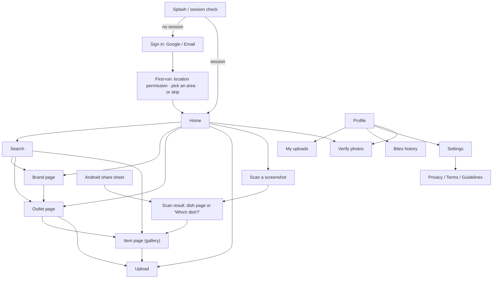
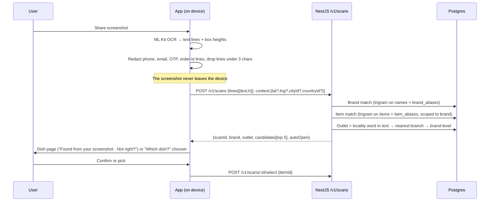
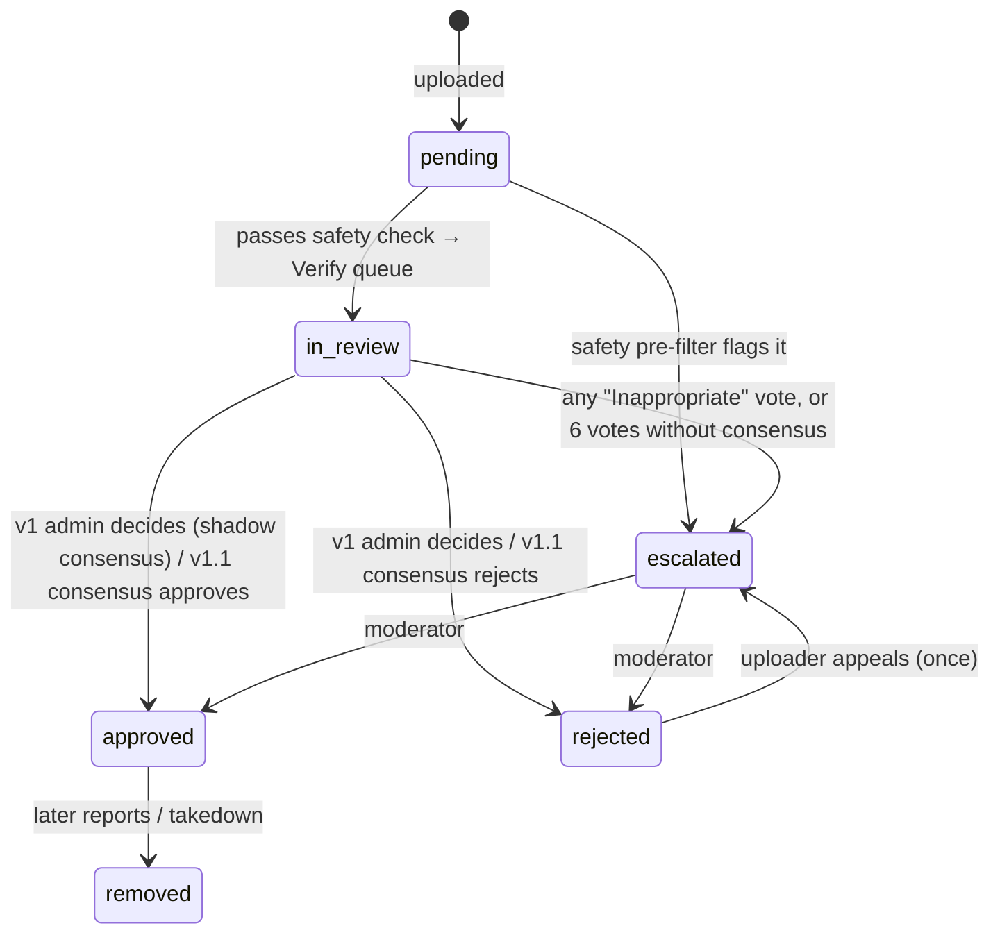
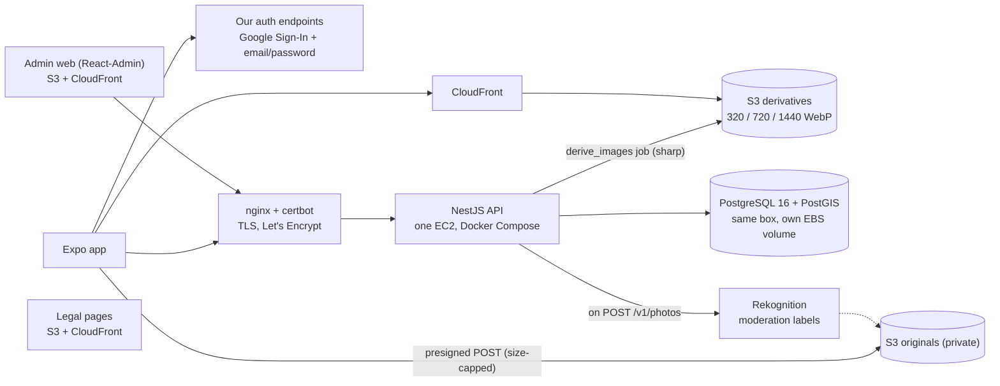

# MVP v1: Chain Brands (current build target)

> The simplest version that is still useful. Start with well-known chains, where photos are easy to get. **Every table, API and screen is generic**, so local independent outlets and other categories plug in later without a redesign.

## 1. Scope

### In scope (v1)
| Area | What ships |
|---|---|
| Brands | Domino's, Pizza Hut, Burger King, Taco Bell, California Burrito (managed as data in the database, never hard-coded) |
| Geography | **Global by default, locally ranked** ([12](12-geography-and-relevance.md)). Seeded data is Bengaluru (India → Karnataka → Bengaluru); anywhere else still searches and falls back outward to country, then global |
| Auth | **Continue with Google** and **email + password** (sign up, sign in, forgot password) |
| Home | Search bar · Top brands carousel · Outlets ranked by geographic tier (nearest first when location is on) · an **area chip** the user can change at any time · "Upload photos, earn Bites" banner |
| Brand page | Brand menu with real photos from all its outlets, plus that brand's outlets near the current area |
| Outlet page | Outlet header, category chips, menu items with the best real photo, evidence badges, "Add photo" |
| Item page | Photo gallery (this outlet first, then the same brand elsewhere), upload call-to-action, report a photo |
| Search | Brands, outlets and items (fuzzy, typo-tolerant) |
| Upload | Outlet → item → camera or gallery → consent → submit → *pending review* |
| **Screenshot share** | Screenshot in any app → Share → **Real Dish** (or "Scan a screenshot" in-app). Text is read **on the device** and matched to our catalog; the right dish page opens. The screenshot never leaves the phone. |
| **Community verification** | Other users check uploaded photos ("Is this Margherita from Domino's?") in a Verify queue and earn a little (1 Bite per correct vote). v1 runs in **shadow mode**: the community votes, an admin makes the final call, and we measure how often they agree. |
| Credits | Earn-only **Bites** ledger. Credited when a photo is approved (uploader) or a vote matches the outcome (verifier). Balance and history in Profile. |
| Settings | Account, Appearance (**System / Light / Dark**), Location, Privacy Policy, Terms & Conditions, Content Guidelines, Delete account, Sign out |
| Admin | Web console: brands, outlets, items, **bulk photo upload (manual seeding)**, moderation queue |

### Out of scope for v1 (designed for, built later)
- YouTube and Google Places photos, web discovery (see [04](04-image-acquisition-and-cost.md))
- AI parsing fallback for screenshots, and the floating bubble (see [05](05-scan-and-overlay.md))
- Paywall and spending Bites (see [08](08-monetization-and-unit-economics.md))
- Consensus auto-approval (v1.1), community-verified *edits*, guide levels and badges, bounties (see [07](07-rewards-system.md))
- Local independent outlets (the schema already supports them), iOS release, the AI Gateway

---

## 2. How the data stays generic

The rule: **the menu belongs to the brand, and outlets inherit it.** Photos attach to an *item*, and optionally to an *outlet*.

| Concept | Chain (Domino's) | Local place (Rameshwaram Cafe, later) |
|---|---|---|
| `brands` | one row, `brand_type = 'chain'` | one row, `brand_type = 'independent'` |
| `outlets` | many rows (every branch) | usually one row |
| `items` | the brand-level menu (Margherita, Farmhouse…) | that place's menu |
| `outlet_items` | *optional* per-branch availability and price overrides | usually unused |
| `photos.outlet_id` | the branch where it was shot, or `NULL` for "brand-level" seed photos | the place |
| `verticals` | `food` | `food` (later: `electronics`, `fashion`…) |
| `attributes jsonb` | veg/non-veg, sizes, crusts | spice level, etc. |

**Evidence labels are computed at read time** by comparing the photo with the outlet being viewed:

| Condition | Label |
|---|---|
| `photo.outlet_id = viewing outlet` | **This outlet** |
| same brand, photo's outlet in the same city | **Same brand, this city** |
| same brand, same region | **Elsewhere in {region}** |
| same brand, same country | **{Country}** |
| same brand, another country | **Worldwide** |
| `photo.outlet_id IS NULL` and `source = 'admin_seed'` | **Real Dish team photo** |
| item has no approved photos | **No real photo yet: be the first (+Bites)** |

---

## 3. Database schema (PostgreSQL 16 + PostGIS, via Drizzle migrations)

```sql
create extension if not exists postgis;
create extension if not exists pg_trgm;
create extension if not exists citext;

-- ── Reference ──────────────────────────────────────────────
create table verticals (
  id    smallserial primary key,
  slug  citext unique not null,            -- 'food'
  name  text not null
);

-- Geography is three linked tables, not one polymorphic table (docs/12 §2.1).
-- It ranks results; it never filters them.
create table countries (
  id           uuid primary key default gen_random_uuid(),
  iso2         char(2) not null unique,
  iso3         char(3) not null unique,
  name         text not null,
  slug         citext not null unique,
  phone_code   text,
  currency     char(3),
  center       geography(Point, 4326),
  is_launched  boolean not null default false,  -- we curate here; NOT a search filter
  created_at   timestamptz not null default now()
);

create table states (
  id           uuid primary key default gen_random_uuid(),
  country_id   uuid not null references countries(id),
  code         text,                             -- ISO 3166-2 suffix: 'KA'
  name         text not null,
  slug         citext not null,
  kind         text not null default 'state',    -- state | union_territory | province | region
  center       geography(Point, 4326),
  is_launched  boolean not null default false,
  created_at   timestamptz not null default now(),
  unique (country_id, slug),
  unique (id, country_id)
);

create table cities (
  id           uuid primary key default gen_random_uuid(),
  country_id   uuid not null references countries(id),
  state_id     uuid,                             -- null for city-states
  name         text not null,
  slug         citext not null,
  center       geography(Point, 4326) not null,
  timezone     text,
  is_launched  boolean not null default false,
  created_at   timestamptz not null default now(),
  unique (country_id, slug),
  unique (id, country_id),
  foreign key (state_id, country_id) references states (id, country_id)
);
create index countries_name_trgm on countries using gin (name gin_trgm_ops);
create index states_name_trgm on states using gin (name gin_trgm_ops);
create index cities_name_trgm on cities using gin (name gin_trgm_ops);

-- Where a user is: context with a source and a confidence, never a restriction (docs/12 §2.3).
-- 'last_seen' is what a search reads first; 'home' is the fallback.
create table user_locations (
  id           uuid primary key default gen_random_uuid(),
  user_id      uuid not null references users(id) on delete cascade,
  kind         text not null check (kind in ('home','last_seen')),
  source       text not null check (source in ('device_precise','device_approximate',
                 'picked_city','picked_state','picked_country','screenshot',
                 'inferred_locale','inferred_ip')),
  confidence   smallint not null check (confidence between 0 and 100),
  country_id   uuid references countries(id),
  state_id     uuid,
  city_id      uuid,
  point        geography(Point, 4326),           -- private; never returned
  accuracy_m   integer,
  captured_at  timestamptz,
  created_at   timestamptz not null default now(),
  updated_at   timestamptz not null default now(),
  unique (user_id, kind),
  foreign key (city_id, country_id)  references cities (id, country_id),
  foreign key (state_id, country_id) references states (id, country_id),
  check (country_id is not null or state_id is not null
      or city_id is not null or point is not null)
);

-- ── Users & consent ───────────────────────────────────────
create table users (
  id             uuid primary key default gen_random_uuid(),
  cognito_sub    text unique not null,
  email          citext,
  display_name   text,
  avatar_url     text,
  role           text not null default 'user' check (role in ('user','moderator','admin')),
  theme_pref     text not null default 'system' check (theme_pref in ('system','light','dark')),
  created_at     timestamptz not null default now(),
  deleted_at     timestamptz                -- soft delete, then purged by a job
);

create table consents (
  id           uuid primary key default gen_random_uuid(),
  user_id      uuid not null references users(id),
  kind         text not null check (kind in ('terms','privacy','photo_display','photo_commercial','photo_training','location')),
  version      text not null,              -- e.g. 'terms-2026-09'
  granted_at   timestamptz not null default now(),
  revoked_at   timestamptz
);

-- ── Catalog (generic) ─────────────────────────────────────
create table assets (                       -- any stored file
  id              uuid primary key default gen_random_uuid(),
  kind            text not null check (kind in ('brand_logo','brand_cover','item_photo','avatar')),
  owner_user_id   uuid references users(id),
  s3_key          text not null,            -- private original
  mime            text not null,
  width           int, height int, bytes int,
  sha256          text,                     -- exact-duplicate check
  phash           bigint,                   -- near-duplicate check (later)
  created_at      timestamptz not null default now()
);

create table brands (
  id              uuid primary key default gen_random_uuid(),
  vertical_id     smallint not null references verticals(id),
  slug            citext unique not null,   -- 'dominos'
  name            text not null,
  brand_type      text not null default 'chain' check (brand_type in ('chain','independent')),
  logo_asset_id   uuid references assets(id),
  cover_asset_id  uuid references assets(id),
  accent_color    text,                     -- hex, for the outlet header
  is_featured     boolean not null default false,
  featured_rank   int,
  status          text not null default 'draft' check (status in ('draft','active','archived')),
  created_at      timestamptz not null default now(),
  updated_at      timestamptz not null default now()
);
create table brand_aliases (brand_id uuid references brands(id) on delete cascade, alias citext, primary key (brand_id, alias));
create index brands_name_trgm on brands using gin (name gin_trgm_ops);

create table outlets (
  id               uuid primary key default gen_random_uuid(),
  brand_id         uuid not null references brands(id),
  country_id       uuid not null references countries(id),  -- the only level required
  state_id         uuid,
  city_id          uuid,
  name             text not null,           -- 'Domino's Pizza, Indiranagar'
  locality         text,                    -- 'Indiranagar'
  address          text,
  postal_code      text,
  location         geography(Point, 4326),          -- an outlet seen only in a screenshot has none
  geo_source       text check (geo_source in ('admin','places','screenshot','inferred')),
  geo_confidence   smallint,
  google_place_id  text unique,             -- optional; the only Google field we may keep forever
  status           text not null default 'active' check (status in ('draft','active','closed')),
  created_at       timestamptz not null default now(),
  updated_at       timestamptz not null default now()
);
create index outlets_location_gix on outlets using gist (location);
create index outlets_area_brand on outlets (geo_area_id, brand_id) where status = 'active';
create index outlets_country_brand on outlets (country_id, brand_id) where status = 'active';
create index outlets_name_trgm on outlets using gin ((name || ' ' || coalesce(locality,'')) gin_trgm_ops);

create table item_categories (
  id          uuid primary key default gen_random_uuid(),
  brand_id    uuid not null references brands(id) on delete cascade,
  name        text not null,                -- 'Pizzas', 'Sides'
  sort_order  int not null default 0
);

create table items (
  id            uuid primary key default gen_random_uuid(),
  brand_id      uuid not null references brands(id),
  category_id   uuid references item_categories(id),
  slug          citext not null,
  name          text not null,              -- 'Margherita'
  description   text,                       -- our own words; never copy brand ad copy
  attributes    jsonb not null default '{}',-- {"diet":"veg","sizes":["Regular","Medium","Large"]}
  status        text not null default 'active' check (status in ('draft','active','discontinued')),
  created_at    timestamptz not null default now(),
  updated_at    timestamptz not null default now(),
  unique (brand_id, slug)
);
create index items_name_trgm on items using gin (name gin_trgm_ops);

create table outlet_items (                 -- optional overrides; no row = inherit the brand menu
  outlet_id     uuid references outlets(id) on delete cascade,
  item_id       uuid references items(id)   on delete cascade,
  is_available  boolean not null default true,
  price_minor   int,                        -- paise
  primary key (outlet_id, item_id)
);

-- ── Photos ────────────────────────────────────────────────
create table photos (
  id                uuid primary key default gen_random_uuid(),
  asset_id          uuid not null references assets(id),
  item_id           uuid not null references items(id),
  brand_id          uuid not null references brands(id),   -- denormalized for fast brand queries
  outlet_id         uuid references outlets(id),           -- NULL = brand-level photo
  source            text not null check (source in ('admin_seed','user_upload','licensed','merchant')),
  rights_tier       smallint not null default 1,           -- see 03-rights-and-sources.md
  license_ref       text,                                  -- licence/contract id for licensed or seed photos
  uploader_user_id  uuid references users(id),
  capture_mode      text check (capture_mode in ('camera','gallery')),
  captured_at       timestamptz,
  capture_location  geography(Point, 4326),                -- private; never returned by the API
  status            text not null default 'pending'
                    check (status in ('pending','in_review','escalated','approved','rejected','removed')),
                    -- pending: awaiting safety pre-filter · in_review: in the community Verify queue
                    -- escalated: flagged / no consensus → admin
  rejection_reason  text,
  reviewed_by       uuid references users(id),
  reviewed_at       timestamptz,
  is_cover          boolean not null default false,        -- best photo for the item (per brand)
  helpful_count     int not null default 0,
  created_at        timestamptz not null default now()
);
create index photos_item_approved on photos (item_id, created_at desc) where status = 'approved';
create index photos_outlet_item   on photos (outlet_id, item_id)      where status = 'approved';
create index photos_pending       on photos (created_at)              where status in ('pending','in_review','escalated');

create table item_aliases (                 -- alternative spellings, used by search and screenshot matching
  item_id  uuid references items(id) on delete cascade,
  alias    citext,
  primary key (item_id, alias)
);
create index item_aliases_trgm on item_aliases using gin ((alias::text) gin_trgm_ops);

-- ── Screenshot scans (no image, no raw text stored) ──────
create table scans (
  id                  uuid primary key default gen_random_uuid(),
  user_id             uuid not null references users(id),
  entry               text not null check (entry in ('share_intent','in_app_picker','overlay')),
  parser              text not null,        -- 'catalog_v1' | 'ai:<provider>/<model>'
  detected_brand_id   uuid references brands(id),
  detected_outlet_id  uuid references outlets(id),
  candidates          jsonb not null default '[]',   -- [{item_id, score}]
  selected_item_id    uuid references items(id),     -- what the user confirmed
  auto_opened         boolean not null default false,
  created_at          timestamptz not null default now()
);

-- ── Community verification ────────────────────────────────
create table verification_tasks (
  id              uuid primary key default gen_random_uuid(),
  subject_type    text not null default 'photo' check (subject_type in ('photo','photo_retag','item_suggestion')),
  subject_id      uuid not null,             -- photos.id for v1
  status          text not null default 'open' check (status in ('open','resolved','escalated')),
  is_gold         boolean not null default false,   -- known-answer task used to measure verifiers
  gold_answer     text,
  community_outcome text,                    -- what weighted consensus says (shadow mode in v1)
  final_outcome   text,                      -- admin decision (v1) or consensus (v1.1+)
  decided_by      text check (decided_by in ('admin','consensus')),
  vote_count      smallint not null default 0,
  created_at      timestamptz not null default now(),
  resolved_at     timestamptz
);
create index verification_open on verification_tasks (created_at) where status = 'open';

create table verification_votes (
  id                 uuid primary key default gen_random_uuid(),
  task_id            uuid not null references verification_tasks(id),
  voter_id           uuid not null references users(id),
  answer             text not null check (answer in ('yes','wrong_item','not_real','inappropriate','unsure')),
  suggested_item_id  uuid references items(id),     -- with 'wrong_item'
  weight             numeric(3,2) not null,         -- snapshot of the voter's weight at vote time
  matched_outcome    boolean,                       -- filled on resolution; drives the reward
  created_at         timestamptz not null default now(),
  unique (task_id, voter_id)
);

create table verifier_stats (
  user_id        uuid primary key references users(id),
  calibrated_at  timestamptz,                -- passed the 5-question tutorial
  votes          int not null default 0,
  gold_seen      int not null default 0,
  gold_correct   int not null default 0,
  weight         numeric(3,2) not null default 0.5,   -- 0 (ignored) … 1.5 (trusted)
  updated_at     timestamptz not null default now()
);

create table photo_reports (
  id          uuid primary key default gen_random_uuid(),
  photo_id    uuid not null references photos(id),
  reporter_id uuid not null references users(id),
  reason      text not null check (reason in ('not_this_item','not_real','offensive','copyright','privacy','other')),
  note        text,
  status      text not null default 'open' check (status in ('open','actioned','dismissed')),
  created_at  timestamptz not null default now()
);

-- ── Credits (append-only ledger) ──────────────────────────
create table credit_ledger (
  id               bigserial primary key,
  user_id          uuid not null references users(id),
  delta            int  not null,                          -- + earn / − spend or reversal
  reason           text not null check (reason in ('upload_approved','pioneer_bonus','verify_vote','admin_adjust','reversal','spend')),
  ref_type         text,                                   -- 'photo'
  ref_id           uuid,
  status           text not null default 'available' check (status in ('pending','available','reversed')),
  expires_at       timestamptz,
  idempotency_key  text unique not null,                   -- e.g. 'photo:<id>:approved'
  created_at       timestamptz not null default now()
);
create view credit_balances as
  select user_id,
         coalesce(sum(delta) filter (where status = 'available'), 0) as available,
         coalesce(sum(delta) filter (where status = 'pending'),   0) as pending
  from credit_ledger group by user_id;
```

**Useful queries:**
```sql
-- Nearby outlets (precise location), within 5 km, nearest first
select o.*, b.name as brand_name, st_distance(o.location, st_makepoint($lng,$lat)::geography) as meters
from outlets o join brands b on b.id = o.brand_id
where o.status = 'active' and b.status = 'active'
  and st_dwithin(o.location, st_makepoint($lng,$lat)::geography, 5000)
order by meters limit 20;

-- Item gallery: geographic tiers rank, they never filter (docs/12 §3).
-- Every parameter may be null; the query still returns the global tier.
select p.*, case
  when p.outlet_id  = $outlet  then 0                     -- This outlet
  when p.city_id    = $city    then 1                     -- Same brand, this city
  when p.state_id   = $state   then 2                     -- Elsewhere in the state
  when p.country_id = $country then 3                     -- Elsewhere in the country
  else 4 end as tier                                      -- Any country
from photos p
where p.item_id = $item and p.status = 'approved'
order by tier, p.created_at desc limit 60;
```

---

## 4. Screens

### 4.1 Navigation
Bottom tabs: **Home · Upload (+) · Profile**. Search opens from the home search bar. Settings is reached from Profile.



### 4.2 Auth
- **Continue with Google**, plus **email + password** (sign up with email verification code, sign in, forgot password).
- Accepting Terms and Privacy on sign-up writes rows to `consents`.
- A session persists in secure storage. A token refresh happens silently.

### 4.3 Home, top to bottom

| # | Section | Behaviour |
|---|---|---|
| 1 | **Header** | App name on the left. **Area chip on the top right** ("Bengaluru ▾", "India ▾", or "Near you ▾" with precise location). Tapping it changes the **current context** for this session — travel works because nothing is pinned to the home area ([12 §2.3](12-geography-and-relevance.md)). |
| 2 | **Search bar** | Placeholder "Search a dish, brand or outlet". Tapping opens the Search screen. A **📷 scan icon** inside the bar opens "Scan a screenshot" (§4.10). |
| 3 | **Top brands** | Horizontal carousel of cards: logo + name. `is_featured` brands ordered by `featured_rank`. Tap → Brand page. |
| 4 | **Outlets near you** *(precise location granted)* | Up to 5 nearest outlets (logo, "Domino's Pizza · Indiranagar", distance, "42 real photos"), then **See all**. |
| 4′ | **Outlets in {area}** *(no precise location)* | Same card list, ranked outward from the chosen area. With no area at all, the country's best-covered outlets. |
| 5 | **Earn banner** | "Upload real food photos, earn Bites 🍕" → Upload flow. |
| 6 | **Verify card** | "Help verify photos · 12 waiting · earn Bites ✅" → Verify screen (§4.11). Hidden when the queue is empty for this user. |

**Location logic:**
1. Ask for location on first run, with an explanation screen first.
2. **Precise granted** → "Near you" mode, which runs the nearby query.
3. **Approximate only or denied** → area mode. The default comes from the nearest city centre, or the picker. Stored as a `user_locations` row (`kind='home'`) and locally.
4. **Declining everything is allowed.** Country comes from the device locale and the app works at country or global tier. Onboarding is never blocked ([12 §2.3](12-geography-and-relevance.md)).
5. Changing the area chip switches the **current context** for the session; it doesn't overwrite the home area unless the user pins it.

**Why at most 5 nearby outlets:** it keeps the Earn banner visible without scrolling.

### 4.4 Brand page
- Header: logo, name, "Not affiliated with {Brand}" in the About sheet.
- Tabs: **Menu** (every item with its cover photo from any outlet, photo counts) · **Outlets** (nearest first when location is on, otherwise ranked outward from the current area).

### 4.5 Outlet page (proposed design)
```
┌──────────────────────────────────────┐
│ ← [logo]  Domino's Pizza             │  header tinted with brand accent_color
│           Indiranagar · 1.2 km       │
│  📍 100 Ft Rd…  (tap → open in Maps)  │
│  126 real photos · 34/48 items shown │
├──────────────────────────────────────┤
│ [Pizzas] [Sides] [Desserts] [Drinks] │  sticky category chips
│ 🔍 Search this menu                   │
├──────────────────────────────────────┤
│ [photo] Margherita           ● veg   │
│         18 photos · 🟢 This outlet    │
│ [photo] Farmhouse            ● veg   │
│         6 photos · ⚪ Same brand      │
│ [ + ]   Peppy Paneer          ● veg  │
│         No real photo yet · +30 Bites │
└──────────────────────────────────────┘
                         ( + Add photo )  FAB, outlet pre-filled
```
- The thumbnail is the best approved photo, chosen by evidence rank, then recency, then `is_cover`.
- Items with no photo stay listed with an earn prompt. That's the supply engine.

### 4.6 Item page
- A full-width swipeable gallery that opens a pinch-zoom viewer.
- Filter chips: **This outlet · All outlets**.
- Each photo shows its evidence label + "2 weeks ago · Koramangala" + the uploader's display name (or "Real Dish team").
- Buttons: **Add your photo**, **Report** (reasons as in `photo_reports`), **Helpful 👍**.

### 4.7 Upload flow
1. **Outlet**: pre-filled when started from an outlet or item. Otherwise nearby outlets or search. It can be left as "Don't know the outlet", which stores a brand-level photo with lower reward.
2. **Item**: search the brand's menu by category. If it's missing, "Suggest an item" (the admin reviews it).
3. **Photo**:
   - **Take photo** (recommended: "+20 Bites") or **Choose from gallery** ("+8 Bites").
   - Up to 5 photos per item.
   - The client downscales to a 2048 px long edge and strips EXIF, except capture time. It sends the device location separately, only if permitted.
4. **Review**: crop or rotate, then guidelines ("your own photo · real food you ordered · no faces · no screenshots or ads").
   - Consent checkboxes: *display* (required) · *commercial use* (optional) · *model training* (optional).
5. **Submit**: a presigned S3 upload, then `POST /v1/photos`. Confirmation: "Submitted · other users will check it · +20 Bites when approved".
6. **My uploads**: statuses *Checking safety* → *Being verified (2/3 votes)* → Approved / Rejected (with reason) / *With a moderator*. The uploader can **appeal** a rejection once.

### 4.8 Profile and Settings
- **Profile:** avatar, name, **Bites balance** (available + pending), My uploads, **Verify photos** (with accuracy "92% · 140 checks"), Bites history.
- **Settings:**
  - **Account:** name, email, sign out, **Delete account**. Google Play requires in-app account deletion plus a web deletion link.
  - **Appearance:** System / Light / Dark (saved locally and to `users.theme_pref`).
  - **Location:** permission status, "Use my location", home area (any level, or none).
  - **Legal:** Privacy Policy · Terms & Conditions · Content Guidelines. These are markdown served from the web (the same URLs go on the Play listing) and rendered in-app.
  - **About:** version, contact support.

### 4.9 Theming
- Semantic design tokens (`bg`, `surface`, `text`, `muted`, `primary`, `success`, `border`), each with a light and a dark value.
- Brand accent colors appear only in outlet and brand headers.
- Evidence badges keep the same hue in both themes.

### 4.10 Screenshot share

**Entry points:**
1. **Android share sheet:** Screenshot → Share → **Real Dish**, through `expo-share-intent` (an intent filter for `image/*`; wired to an Expo Router route via `+native-intent`).
   - If the user isn't signed in, the image is held in memory and the flow resumes after login.
2. **In-app:** the 📷 icon in the Home search bar → gallery picker. It's the same pipeline.
3. *Later:* an iOS Share Extension (same library) and the Android bubble ([05](05-scan-and-overlay.md)).

**Pipeline (v1 uses no AI and costs ₹0):**


**`CatalogScanParser` (server, deterministic):**
1. **Normalize:** lowercase; strip ₹ prices, quantities ("x2", "Medium"), emoji and punctuation. Also try each line joined with the next, because long dish names wrap.
2. **Brand:** the best trigram match against `brands.name` plus `brand_aliases` ("dominos", "domino's pizza", "bk", "cali burrito"). Threshold 0.45.
3. **Items:** trigram similarity against `items.name` plus `item_aliases`, scoped to the detected brand (or all brands if none). **score = similarity × prominence**, where prominence = the line's height ÷ the median line height, capped at 2. The dish in focus usually has the biggest text.
4. **Auto-open** when top score ≥ 0.6 and ≥ 1.25× the runner-up. Otherwise show the "Which dish?" chooser.
5. **Multiple dishes** (a cart or menu list): show them as switchable chips on the result screen.
6. **Extensibility:** `ScanParser` is an interface. The later `AiScanParser` goes through the AI Gateway ([02b](02b-ai-gateway.md)) as a fallback when scores are low, and for local outlets. A config flag picks the parser.

**Screens:**
- **Processing:** a thumbnail of the screenshot (local only) and "Reading dish name…", usually under a second.
- **Found:** the item page with a banner: "Found from your screenshot: Margherita · Domino's (Indiranagar) · **Not right?**". Tapping Not right? opens the chooser.
- **Which dish?:** up to 5 candidate cards (cover photo, name, brand, photo count), then "Search manually".
- **Nothing found:** "We couldn't read a dish name. Try search", with the recognised brand pre-filled if there was one.

**Privacy and counting:**
- Nothing but matched IDs, scores and the user's choice is stored (`scans`).
- v1 has **no scan limit**. Scans are counted per user so metering is ready when the paywall arrives.

**Eval before launch:**
- 60–100 real screenshots of the 5 brands (brand apps, Zomato, Swiggy).
- Targets: **top-1 ≥85%, top-3 ≥95%**; p95 under 1.5 s on a mid-range Android phone.
- Tune the aliases and thresholds from `scans.selected_item_id` feedback.

### 4.11 Community verification ("Verify photos")

This works like Google Maps' "check facts": other people confirm each upload before it goes public.

**Pipeline for every user upload:**


**Safety pre-filter** (before anyone sees the photo): a pluggable `SafetyScanner`.
- The default is **AWS Rekognition `DetectModerationLabels`**, ~$1 per 1,000 images.
- It checks for nudity, violence and similar, plus a check that the photo isn't a document or face close-up.
- A flagged photo goes to moderators only.

**Verify screen** (a card stack, one photo at a time):
```
┌──────────────────────────────────────┐
│ Verify photos            4 / 10  +4 🍪│
│ ┌──────────────────────────────────┐ │
│ │          [ user photo ]          │ │
│ └──────────────────────────────────┘ │
│ Is this  Margherita                  │
│ from     Domino's Pizza?             │
│ Looks like these? [ref][ref][ref]    │  approved photos of the same item
│                                      │
│ [ ✅ Yes, matches ]                    │
│ [ ❌ Different dish ] → pick from menu  │
│ [ 🚫 Not a real food photo ]           │  screenshot / ad / stock / not food
│ [ ⚠ Inappropriate ]   [ Skip ]        │
└──────────────────────────────────────┘
```
- **Blind:** the verifier doesn't see who uploaded it, other votes, or the uploader's location.
- The outlet isn't asked about, because a photo can't show which branch it came from. Outlet trust comes from the uploader's GPS instead ([07](07-rewards-system.md)).
- **Unlock:** a 5-question calibration tutorial built from known-answer photos. The account also needs a verified email.
- **Session:** 10 cards, then a summary ("You checked 10 photos · +6 Bites pending · accuracy 90%").

**Integrity rules:**
- **Assignment is random** from the open queue.
  - Nobody gets their own uploads.
  - Nobody verifies uploads from someone they referred or who shares their device.
  - A verifier gets at most 3 tasks per uploader per day.
  - Priority goes to tasks closest to a decision.
- **Gold tasks:** about 1 in 5 cards is a photo with a known answer (admin-approved or rejected). Gold accuracy sets the **vote weight**:

  | Gold accuracy (after ≥10 gold) | Weight |
  |---|---|
  | New verifier (<10 gold) | 0.5 |
  | ≥ 90% | 1.0 |
  | ≥ 95% and ≥ 200 votes | 1.5 |
  | < 70% | **0** (votes silently ignored, no rewards) |
- **Weighted consensus**, computed on every vote:
  - **approve** if yes-weight ≥ 2.5 **and** yes makes up ≥80% of the weight
  - **reject** if the negative weight (`wrong_item` + `not_real`) ≥ 2.0 **and** ≥70%
  - one ⚠ Inappropriate vote → hidden immediately and escalated
  - 6 votes with no decision → escalated.
- **"Different dish" votes:** when ≥2 of them suggest the same item, a **retag** proposal goes to the admin. In v1.1 it becomes its own verification task.

**Phases:**
| Phase | Who decides | What the community vote does |
|---|---|---|
| **v1 (MVP): shadow consensus** | **Admin** approves or rejects from the moderation console. The console shows the community tally next to each photo, sorted by it. | Votes, gold tasks and weights are all live. Verifier Bites are paid against the **admin's** decision. We track **community–admin agreement**. |
| **v1.1** | **Consensus** decides automatically once agreement ≥95% over the last 200 decided tasks. Admins handle escalations, appeals and a 5% random audit. | Retag tasks are live. |
| **Phase 2** | Consensus, plus an AI pre-check as one extra weighted voter (via [02b](02b-ai-gateway.md)) | Community-verified **edits**: missing items, outlet closed or moved, name aliases. Guide levels and badges. |

**Unverified photos are never shown in public galleries.** Only the uploader (in My uploads) and assigned verifiers see them.

---

## 5. API (NestJS, `/v1`, our own JWT on every route except health and auth — full contract in [11-backend-mvp1.md](11-backend-mvp1.md))

| Method & path | Purpose |
|---|---|
| `GET /v1/me` · `PATCH /v1/me` · `DELETE /v1/me` | Profile, preferences (`homeAreaId`, theme), account deletion |
| `POST /v1/me/consents` | Record consent grants and revocations |
| `GET /v1/geo/{countries,states,cities}` · `GET /v1/geo/search?q=` · `GET /v1/geo/resolve?lat=&lng=` | Browse per level, one grouped search for the picker, and coordinate resolution |
| `GET /v1/home?cityId=&stateId=&countryId=&lat=&lng=` | `{ featuredBrands[], outlets[], mode, banner }` — all geographic parameters optional |
| `GET /v1/brands?featured=true` · `GET /v1/brands/:slug?countryId=&cityId=&lat=&lng=` | Brand list and page (menu resolved through `item_markets`, outlets ranked by tier) |
| `GET /v1/outlets?cityId=&stateId=&countryId=&brandId=&lat=&lng=&radiusM=` | Outlets under any level, or nearest-first |
| `GET /v1/outlets/:id` | Outlet + categories + items (cover photo, count, evidence label) |
| `GET /v1/items/:id/photos?outletId=&scope=outlet\|all&cursor=` | Ranked gallery with evidence labels |
| `GET /v1/search?q=&cityId=&countryId=&lat=&lng=` | `{ brands[], outlets[], items[] }` via trigram + aliases; each result carries `geo:{tier,label,path}` |
| `POST /v1/uploads/presign` | `{ assetId, url, fields }`: S3 presigned **POST** policy (`content-length-range` 1 KB–10 MB, content type, key prefix, 5-min expiry). The bytes are re-verified server-side before a photo exists — [11 §4.2](11-backend-mvp1.md) |
| `POST /v1/photos` | `{ assetId, itemId, outletId?, captureMode, capturedAt, location?, consents }` → `pending` |
| `GET /v1/me/photos` · `GET /v1/me/credits` | My uploads, and Bites balance + ledger |
| `POST /v1/photos/:id/report` · `POST /v1/photos/:id/helpful` | Community signals |
| `POST /v1/item-suggestions` | "Item not in menu" |
| `POST /v1/scans` | `{ entry, lines[{text,h}], context:{lat?,lng?,cityId?,countryId?} }` → `{ scanId, brand?, outlet?, detectedContext, candidates[], autoOpen }` |
| `POST /v1/scans/:id/select` | `{ itemId }`: the user's confirmed dish (accuracy feedback) |
| `POST /v1/photos/:id/appeal` | The uploader appeals a rejection (once) |
| `GET /v1/verify/eligibility` · `POST /v1/verify/calibration` | Tutorial status and answers (unlocks verifying) |
| `GET /v1/verify/next?count=10` | Next tasks for this user (with gold mixed in; the server hides which are gold) |
| `POST /v1/verify/:taskId/vote` | `{ answer, suggestedItemId? }`, returns the updated session progress |
| `GET /v1/me/verify-stats` | Votes, accuracy, weight, Bites earned from verifying |
| **Admin** (`role in (moderator, admin)`) | |
| `CRUD /v1/admin/brands · outlets · items · categories · geo/{countries,states,cities}` | Catalog management |
| `POST /v1/admin/import/{outlets\|items}` | CSV import (see §7) |
| `POST /v1/admin/photos/bulk` | Manual seed upload: many images → one item, optional outlet, `source = admin_seed` |
| `GET /v1/admin/photos?status=in_review\|escalated&sort=community` · `POST /v1/admin/photos/:id/{approve\|reject\|retag}` | Moderation, showing the community tally. **One transaction** sets the photo status, resolves the task, marks each vote's `matched_outcome`, and writes the Bites ledger rows for the uploader and matching verifiers. |
| `POST /v1/admin/verify/gold` | Mark an approved or rejected photo as a gold task with its answer |
| `GET /v1/admin/verify/metrics` | Community–admin agreement, time to decision, verifier accuracy distribution |
| `GET /v1/admin/reports` · `POST /v1/admin/reports/:id/{action\|dismiss}` | Report queue |

**Response contracts** are Zod schemas in `packages/shared`, used by the API (validation and OpenAPI) and by the app (typed client).

---

## 6. Infrastructure for v1 (a lean subset of [02-architecture](02-architecture.md))



| Piece | v1 choice |
|---|---|
| Mobile | Expo (dev build), Expo Router, TypeScript, **NativeWind** (tokens + dark mode), TanStack Query, Zustand, `expo-location`, `expo-image-picker` / `expo-camera`, `expo-image`, `expo-image-manipulator`, **`@react-native-google-signin/google-signin`** (Google ID token sent to our API) + email/password forms, `expo-secure-store`, **`expo-share-intent`** (share target), **`@react-native-ml-kit/text-recognition`** (on-device OCR), Sentry |
| Safety pre-filter | **AWS Rekognition `DetectModerationLabels`**, called by the API after upload, behind a `SafetyScanner` interface so it can be swapped |
| API | NestJS, **Drizzle ORM** (SQL-first migrations in the repo), Zod (shared), our own JWT guard, `@nestjs/throttler`, **`@node-rs/argon2`** for passwords |
| Database | **PostgreSQL 16 + PostGIS in a container on the same EC2 box**, on its own EBS volume, `pg_trgm` + `citext`. Backups are ours: WAL archiving + nightly dump to S3 + EBS snapshots ([11](11-backend-mvp1.md) §7.2) |
| Media | S3 private originals + derivatives bucket, resized by a `derive_images` job in the API (`sharp`), served as signed CloudFront URLs |
| Auth | **Ours** — Google ID tokens verified against Google's JWKS, Argon2id passwords, 15-min access JWT + rotating refresh, `users.role` for `admin` / `moderator`. See [11](11-backend-mvp1.md) §2 |
| Admin | React-Admin SPA on S3 + CloudFront, using the NestJS admin endpoints |
| Hosting | **One EC2 `t4g.small`** (Docker Compose: nginx + certbot, api, postgres), Elastic IP, no SSH (SSM Session Manager), no ALB, no NAT |
| IaC / CI | AWS CDK (TypeScript), GitHub Actions → ECR → SSM deploy; EAS Build for Android |
| **Not yet** | SQS/worker, Valkey, EventBridge, AI Gateway, RevenueCat: add them when the features that need them arrive |
| Cost | **≈ $25–35/month.** No ALB, no RDS, no NAT Gateway. Full breakdown and the triggers for moving back to managed pieces: [11](11-backend-mvp1.md) §7.4–7.5 |

**Repo layout:**
```
apps/mobile   apps/api   apps/admin   packages/shared   infra/   docs/
```
pnpm workspaces + Turborepo.

---

## 7. Seed data (manual, rights-cleared)

| Dataset | How | Size (Bengaluru) |
|---|---|---|
| Brands | Admin form: name, slug, logo, accent color, featured rank | 5 |
| Outlets | **CSV import**: `brand_slug, country_iso2, state_slug?, city_slug?, name, locality, address, postal_code, lat?, lng?, google_place_id?` (only the country is required). Addresses are public facts; don't copy Google Places content (see [03](03-rights-and-sources.md)). | ~150–250 (all branches of the 5 chains) |
| Menu | CSV import: `brand_slug, category, item_name, diet, sizes, description?`. Names are facts; write our own short descriptions and **never copy brand ad copy or ad images**. | ~40–60 items per brand, ~250 total |
| Photos | Admin bulk upload: **only photos we took or licensed**, as `source = admin_seed`, `license_ref` filled in. Brand-level (`outlet_id NULL`) unless shot at a known outlet. | Target ≥3 per item for the top 100 items |

**Logos:** use them for identification only, add a "not affiliated" disclaimer, and keep a takedown path. If counsel prefers, fall back to name monograms.

---

## 8. Bites in v1 (earn-only)
| Event | Bites | Ledger status |
|---|---|---|
| Upload approved: camera, outlet chosen | 20 | `available` on approval |
| Upload approved: gallery or no outlet | 8 | `available` on approval |
| Pioneer: first approved photo for the item at that outlet (or brand-level if no outlet) | +30 | `available` on approval |
| **Verify vote that matches the final outcome** | **1** (capped at 20 per day; gold tasks count) | `available` on resolution |
| Verify vote that doesn't match, or verifier weight 0 | 0 | — |
| Photo later removed for a violation | − original amount | `reversal` row |

- Every write uses `idempotency_key = 'photo:<id>:<event>'`.
- The balance shows now, with a "Coming soon: spend Bites on Pro" teaser.
- The full economy (caps, trust levels, spending) is in [07-rewards-system.md](07-rewards-system.md).

---

## 9. Definition of done for v1
- [ ] Sign in with Google and with email/password; the session persists; account deletion works (in-app and web link).
- [ ] Home shows featured brands, then outlets ranked by tier (nearby with precise location, otherwise from the area chip), then the earn banner.
- [ ] Declining location **and** skipping the area picker still reaches a working home screen with country or global results.
- [ ] A dish with no local photos shows country or worldwide groups, never an empty state.
- [ ] Brand, outlet and item pages show approved photos with correct evidence labels, in light and dark themes.
- [ ] Search finds brands, outlets and items with typos ("dominoes margarita").
- [ ] A user upload passes the safety pre-filter and enters the Verify queue. Other users vote. An admin approves it and Bites appear for the uploader and for matching verifiers. A rejection shows its reason; an appeal works.
- [ ] Verify: the calibration tutorial unlocks it; gold tasks update accuracy and weight; users never see their own uploads; an "Inappropriate" vote hides the photo instantly.
- [ ] The admin console shows the community tally, and the community–admin agreement metric is reported.
- [ ] Sharing a screenshot from Zomato, Swiggy or a brand app opens Real Dish and lands on the right dish (top-1 ≥85% on the eval set). The screenshot is never uploaded.
- [ ] Admin can import outlets and menus by CSV, bulk-upload seed photos, and moderate.
- [ ] Privacy, Terms and Guidelines are reachable in-app and on the web; the Play Data safety form is drafted.
- [ ] Data for the 5 brands in Bengaluru is seeded; ≥3 photos for the top 100 items.

## 10. Next after v1
1. **v1.1:** consensus auto-approval (once agreement ≥95%), retag tasks, photo ranking and "helpful" signals.
2. The AI Gateway: an AI screenshot-parsing fallback and an AI pre-check voter ([02b](02b-ai-gateway.md)).
3. Local independent outlets and menu-card scanning ([06](06-place-menu.md)); community-verified edits.
4. The Android floating bubble ([05](05-scan-and-overlay.md)).
5. YouTube and Google Places fallbacks ([04](04-image-acquisition-and-cost.md)).
6. Paywall ([08](08-monetization-and-unit-economics.md)).
