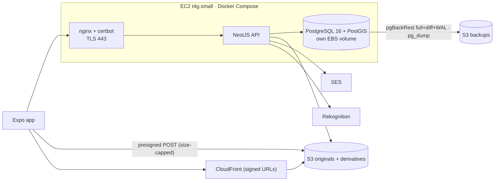
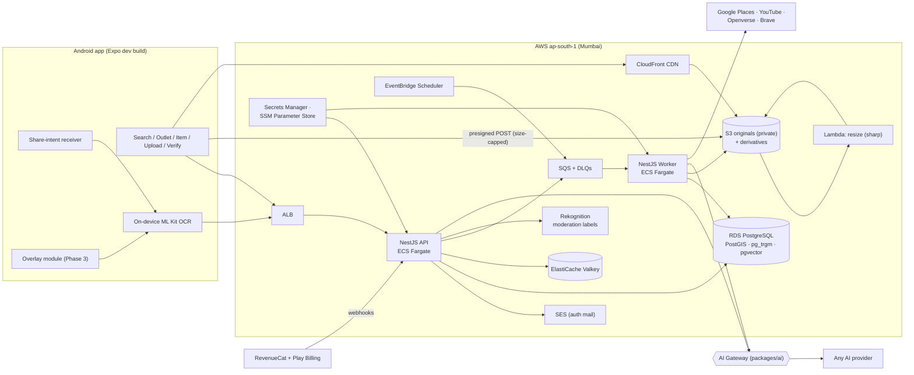
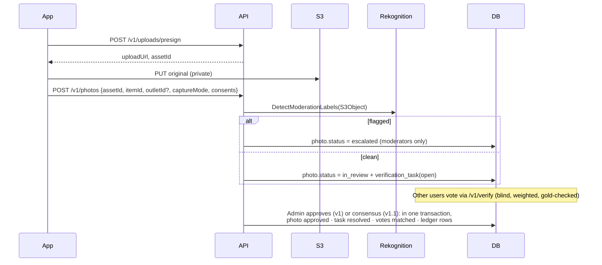

# 02: Architecture (AWS + NestJS)

> **Two shapes live in this doc.** §1 is what runs **today** (v1): one EC2 box, specified in full in [11-backend-mvp1.md](11-backend-mvp1.md). §2 is the **target** we grow into, piece by piece, only when a feature needs it — [11 §7.5](11-backend-mvp1.md) lists the triggers. Nothing below is built yet unless §1 says so.

## 1. v1 today: one box



| | v1 |
|---|---|
| Compute | One EC2 `t4g.small`, Docker Compose (nginx + certbot, api, postgres) |
| TLS | Let's Encrypt via certbot, webroot challenge, auto-renewed |
| Database | PostgreSQL 16 + PostGIS in a container, own EBS volume. Backups are ours: pgBackRest weekly full + daily differential + continuous WAL (PITR), nightly `pg_dump`, daily EBS snapshot — [11 §7.2](11-backend-mvp1.md) |
| Jobs | A `jobs` table polled in-process — no SQS, no worker service |
| Config | SSM Parameter Store (SecureString) |
| Access | No inbound SSH; SSM Session Manager only |
| Cost | ≈ $25–35/month |

**Not in v1:** ALB, ECS Fargate, RDS, Lambda, SQS, EventBridge, ElastiCache, the AI Gateway.

## 2. Target system (what we grow into)


## 3. AWS services
| Service | Role | Added in | Est. monthly (early) |
|---|---|---|---|
| **EC2 `t4g.small`** + EBS | nginx, API and Postgres containers | **v1** | ~$16–18 |
| **S3** (originals, derivatives, backups) | Photos and database backups | **v1** | a few $ |
| **CloudFront** | Signed-URL delivery of derivatives, admin SPA, legal pages | **v1** | a few $ (1 TB/month free) |
| **SES** | Verification and password-reset mail (auth itself is ours — [11](11-backend-mvp1.md)) | **v1** | ~$0.2 |
| **Rekognition** | `DetectModerationLabels` safety pre-filter | **v1** | ~$1 per 1k images |
| **SSM Parameter Store** | JWT signing key, Google client IDs, DB URL, SES creds | **v1** | free |
| **CloudWatch** | Pino JSON logs (30-day retention), disk/memory metrics, alarms | **v1** | a few $ |
| **ALB** | TLS, routing, health checks — replaces nginx | Phase 2 | ~$20 |
| **ECS Fargate** `api` | NestJS HTTP API, 1→N tasks behind the ALB | Phase 2 | ~$15–30 |
| **RDS PostgreSQL 16** | Replaces the Postgres container; managed backups, PITR, `pgvector` later | Phase 2 | ~$15–30 (t4g.micro/small) |
| **Lambda** (`sharp`) | Resizing, if it outgrows the in-process `derive_images` job | Phase 2 | ~$0 |
| ECS Fargate `worker` | SQS consumers: discovery, moderation, embeddings, menu extraction | Phase 2 | ~$10–20 |
| **SQS + DLQ** | Job queues, one per job family | Phase 2 | ~$0–1 |
| **EventBridge Scheduler** | Cron: YouTube refresh (≤30 days), graduation, stale bounties, rollups | Phase 2 | ~$0 |
| **ElastiCache Serverless (Valkey)** | Rate limits, single-flight locks, negative cache | when >1 API task | ~$10+ |
| Grafana Cloud (free tier) | Dashboards and alerting, scraping the API's `/metrics` — **not** self-hosted Prometheus/Grafana, which would cost 300–500 MB on a 2 GB box ([11 §7.4](11-backend-mvp1.md)) | when dashboards are wanted | free tier |
| X-Ray / OTel tracing | Distributed traces once there's more than one service | Phase 2 | a few $ |

**Cost traps:**
- **Don't create a NAT Gateway** (~$35/month plus data). v1 puts the instance in a public subnet with a tight security group; later, use VPC gateway endpoints (S3) and interface endpoints as needed.
- **Every public IPv4 is now billed** (~$3.6/month). One Elastic IP on the instance is the whole allowance in v1.
- Tag everything (`service`, `env`) for cost allocation.

## 4. NestJS module map
```
apps/api/src
├─ auth/          Google ID-token verify, Argon2id passwords, JWT guard, refresh rotation, roles guard
├─ users/         profile, preferences, consents, account deletion
├─ geo/           countries/states/cities, user_locations, coordinate + signal resolution, tier scoring (docs/12)
├─ catalog/       brands (+aliases, markets), outlets, categories, items (+aliases, markets), outlet_items
├─ search/        trigram + alias search, nearby (PostGIS), tiered geographic ranking, home aggregation
├─ media/         presign, asset registry, derivative URLs
├─ photos/        submit, gallery ranking + evidence labels, reports, helpful, appeals
├─ safety/        SafetyScanner interface → RekognitionSafetyScanner
├─ verification/  task assignment, votes, gold tasks, weights, consensus (shadow / auto)
├─ scans/         ScanParser interface → CatalogScanParser (v1) → AiScanParser (later)
├─ credits/       append-only ledger, balances, reward rules engine
├─ admin/         CRUD, CSV import, bulk seed upload, moderation console APIs, metrics
├─ ai/            AiGateway provider (packages/ai), task config loader       ← Phase 2
├─ discovery/     YouTube / Places / Openverse / Brave adapters             ← Phase 2
├─ entitlements/  RevenueCat webhooks, plans, usage counters               ← Phase 4
├─ health/        live + ready probes (@nestjs/terminus)
├─ jobs/          jobs-table poller, leases, retries, handler registry     (11 §6)
├─ audit/         audit_logs writer
└─ common/        config (zod-validated env), db (Drizzle), logging (nestjs-pino + redaction), metrics (prom-client), errors, idempotency
```
- **Worker (`apps/worker`):** Phase 2 only. In v1 the same process runs jobs off the `jobs` table ([11 §6](11-backend-mvp1.md)); the handlers move across unchanged.
- **Rules everywhere:**
  - DTOs are Zod schemas from `packages/shared`, so the app and API share types.
  - The OpenAPI spec is generated from them.
  - Every write that affects credits is **idempotent**.
  - The conventions in §4.1–§4.6 apply to every module. They follow the NestJS best-practices skill checked into the server repo (`.claude/skills/nestjs-best-practices`); §4.7 lists where we deliberately differ.

### 4.1 Feature modules and dependency direction

Each feature is a self-contained folder: `<feature>.module.ts`, `<feature>.controller.ts`, one or more focused `*.service.ts`, `<feature>.repository.ts`, and `dto/` (Zod schemas and their inferred types). No `controllers/`, `services/` or `entities/` folders at the top level.

**Modules form a one-way graph.** A module may import only from a lower layer; a circular import (`forwardRef`) is a design bug, not a workaround.

| Layer | Modules | May import |
|---|---|---|
| 0 · infrastructure (the only `@Global()` modules) | `common/*` (config, db, errors, logging, idempotency) | nothing |
| 1 · leaf domains | `catalog`, `media`, `safety`, `credits`, `audit`, `jobs` | layer 0 |
| 2 | `users`, `verification`, `search`, `scans` | layers 0–1 |
| 3 | `auth`, `photos` | layers 0–2 |
| 4 · orchestration | `admin` | everything; **nothing imports `admin`** |

The two edges most likely to tempt a cycle are settled here. `photos` calls `VerificationService.openTask()` after a safe upload (so `photos → verification`); `verification` never imports `photos` and reads the few `photos` columns it needs (uploader, status) through its own repository. And the approve/reject flow that touches photos, tasks, votes, ledger and audit lives in `admin`, the only layer allowed to see all of them. The layering is provisional: revisit it as each module lands, and any new edge must point downward.

- **Export only what others need.** A service is listed in exactly one module's `providers`; other modules import that module. Never re-provide a service to avoid an import.
- **One responsibility per service.** Split by use case, not by table: `PhotosService` does not do upload submission, gallery ranking and moderation together (`PhotoSubmissionService`, `PhotoGalleryService`, …). A service with `And` in its name, or more than about five collaborators, is a split waiting to happen.
- **Events are for best-effort reactions only.** `@nestjs/event-emitter` may decouple in-process, after-commit side effects. Anything that must not be lost is a `jobs` row inserted **in the same transaction**, and anything that changes status or Bites is a direct call inside one transaction (§4.3), never an event.

### 4.2 Layering: controller → service → repository

| Layer | Owns | Never |
|---|---|---|
| Controller | Route, guards, parsing/validating input, calling one service method, returning a response DTO | Business rules, queries |
| Service | Business rules, orchestration, transactions, throwing domain exceptions | SQL, Drizzle table imports, HTTP details |
| Repository (`*.repository.ts`) | Every query for its feature, using Drizzle | Business decisions |

- **Tables are imported only by repositories.** Repositories select **explicit column lists**, which is what keeps `capture_location`, `gold_answer` and uploader identity out of every response ([11 §8](11-backend-mvp1.md)), and stops over-fetching.
- **Drizzle schema is centralized**, one file per area (`identity`, `catalog`, `media`, `photos`, `verification`, `rewards`, `ops`, mirroring [11 §3](11-backend-mvp1.md)) under `src/common/db/schema/`, not split into feature folders. The schema is one relational graph with cycles (`users ↔ media_assets`, `photos ↔ verification_tasks`) and composite foreign keys across areas; per-feature schema files would force circular imports. Feature isolation comes from repositories being the only readers.
- **No N+1.** A gallery, menu or queue is one query (join, `IN (...)`, or a lateral), never a query per row. Evidence labels are computed in the same query.
- **Ports are small.** Each external dependency is a narrow interface with a `Symbol` injection token and always injected with `@Inject(TOKEN)`, never by relying on emitted type metadata (Vitest doesn't emit it): `PasswordHasher`, `MailSender` (SES), `ObjectStorage` (S3), `SafetyScanner`, `ScanParser`, `GoogleTokenVerifier`, later `AiGateway`. One capability per port (a `MailSender` does not also do push).
- **No service locator.** No `ModuleRef.get()`, no global container lookups: dependencies come in through constructors.
- **Everything is a singleton.** No request-scoped or transient providers (they bubble up the injection tree and slow every request). The current user reaches handlers through a `@CurrentUser()` parameter decorator, and the request id through the logger context.

### 4.3 Transactions

One transaction is one owning service method. Repositories take an optional executor (`Database | Transaction`) as their last argument and use it when given; `common/db` provides `TransactionRunner.run(fn)`, a thin wrapper over Drizzle's `db.transaction`. The orchestrating service opens the transaction and passes `tx` down to each repository and to the lower-layer service methods it calls (`CreditsService.grant(input, tx)`, `VerificationService.resolve(input, tx)`). There is no ambient or per-request transaction.

The transactions that matter, all named in [11 §4](11-backend-mvp1.md): admin approve/reject, photo submission, refresh-token rotation (`FOR UPDATE`), verification assignment (`FOR UPDATE SKIP LOCKED`), account purge.

### 4.4 The response envelope, and errors

Every response — success or failure — is JSON in one fixed envelope, built in exactly one place
on each side so a handler can never hand-roll or drift from it ([11 §4](11-backend-mvp1.md)):

```jsonc
// 2xx — ResponseEnvelopeInterceptor (common/response), global
{ "success": true, "message": "Countries retrieved successfully", "data": { /* … */ } }

// A list: cursor pagination nests inside data, alongside items
{ "success": true, "message": "Cities retrieved successfully",
  "data": { "items": [ /* … */ ], "pagination": { "nextCursor": "…" } } }

// 4xx/5xx — GlobalExceptionFilter (common/errors), global
{ "success": false, "message": "Request validation failed", "error_code": "validation_failed",
  "data": {}, "details": [ { "path": "limit", "message": "Too small: expected number to be >=1" } ] }
```

This is the team's adopted standard, adapted rather than copied verbatim from the article it's
based on: pagination stays **cursor-based** (`items` + `pagination.nextCursor`), never the
article's offset fields (`current_page`, `total_pages`, …) — [12](12-geography-and-relevance.md)
picked keyset pagination for good reasons and this doesn't reopen that. `error_code` carries this
codebase's own stable string `DomainException.code` (`photo_not_found`, `quota_exceeded`,
`validation_failed`), not a numeric catalog borrowed from an unrelated app.

- Services throw **domain exceptions**: subclasses of a `DomainException` base (`common/errors`) carrying a stable machine `code` and an HTTP status. Controllers don't catch and reshape errors.
- `GlobalExceptionFilter`, registered globally (`APP_FILTER`), is the only place the error envelope is produced. It maps `DomainException` (`code`/`status` read straight off the exception), Nest's own `HttpException` (an unmatched route, a method mismatch — `error_code` derived from the HTTP status), and everything else (`500 internal_error`, generic message, real error logged with the request id via `PinoLogger`, never sent to the client). `429` adds `Retry-After`.
- `ResponseEnvelopeInterceptor`, registered globally (`APP_INTERCEPTOR`), is the only place the success envelope is produced. Handlers keep returning plain response DTOs from their mappers; `@ResponseMessage('…')` sets `message` (default `"OK"`).
- **One opt-out: health.** `/v1/health` keeps `@nestjs/terminus`'s own body — `{ status, info, error, details }` on both 200 and 503 — because the external uptime check depends on that exact shape ([11 §4](11-backend-mvp1.md)). `@SkipEnvelope()` keeps the interceptor off it; a controller-level `HealthUnavailableFilter` (which Nest resolves before the global filter) re-emits Terminus' 503 body untouched.
- **Async work can't reach the filter.** The jobs poller, `@Cron` handlers and event listeners catch and record their own errors (`jobs.last_error`, structured log); no fire-and-forget promises. A process-level `unhandledRejection` handler is only a last-resort logger, not error handling.

### 4.5 Requests: versioning, validation, auth, output

- **Versioning:** Nest's built-in URI versioning, `enableVersioning({ type: VersioningType.URI, defaultVersion: '1' })`, giving `/v1/...`. A breaking change adds a `@Version('2')` handler beside the old one; there is no hand-rolled path prefix.
- **Validation:** Zod at the edge, through one global validation pipe; every `@Body()`, `@Query()` and `@Param()` has a schema. Schemas are **strict** (unknown keys rejected), coerce and trim, and bound every free-text field (`displayName`, item suggestions, report notes) with `max()`. Ids are validated as UUIDs. Cursor and `count` parameters share pipes.
- **Auth:** a global `AuthGuard` registered as `APP_GUARD` is **default-deny**; public routes opt out with `@Public()`. Admin routes add `@Roles('moderator', 'admin')`, checked against the role the guard just loaded from the database ([11 §2.1](11-backend-mvp1.md)), never a token claim. Rate limits use named `@nestjs/throttler` profiles (`auth` strictest, then `write`, `read`); one process means in-memory storage is enough in v1.
- **Output:** controllers return response DTOs built by explicit mappers, never a raw table row; `ResponseEnvelopeInterceptor` wraps the return value into the standard envelope (§4.4), so a handler never builds response JSON itself. User-supplied text is stored as plain text and never interpreted as HTML by the API or the admin SPA.
- **Cross-cutting:** interceptors handle timing and `Idempotency-Key` replay (`common/idempotency`), not copy-pasted code in handlers. Logging is `nestjs-pino`, specified in [11 §7.4](11-backend-mvp1.md): a class injects `PinoLogger`, calls `setContext(Foo.name)` once and logs `logger.warn({ err, ...fields }, 'message')` (object first, message second). It replaces Nest's logger, writes one JSON line per event to stdout in production (pretty in development), logs every request with a `requestId` that every line written during that request shares, keeps query strings out of logs, and redacts credentials by configured path. `LOG_LEVEL` overrides the default (`info` in production, `silent` under test, `debug` otherwise) and `DB_LOG_QUERIES=true` prints SQL text (never parameters) in development. `console.*` is a lint error and `new Logger()` is not used. `PinoLogger` is transient-scoped by design, the one exception to "everything is a singleton". `userId` joins each line once auth exists.
- **Caching:** none in v1 beyond what [11 §2.1](11-backend-mvp1.md) allows (non-privileged reads, ≤ 5 s) and the 6 h Google JWKS cache; in-process only, no Redis.

### 4.6 Testing: deferred

**No tests are written yet, by decision.** Don't add specs, fakes or e2e files unless explicitly asked; the one health e2e that exists stays as it is. The `test` and `test:e2e` scripts and Vitest config remain so tests can be added later without setup.

When testing is picked up, the intended shape is: unit tests for service logic with fakes for the ports in §4.2; integration tests for repositories and the transactions in §4.3 against a real PostgreSQL + PostGIS (the correctness of this system lives in SQL: composite foreign keys, the append-only ledger trigger, partial unique indexes, `SKIP LOCKED`); a few end-to-end HTTP flows; and no test ever calling S3, SES, Rekognition or Google.

### 4.7 Where we deliberately differ from the NestJS best-practices skill

| Skill says | We do | Why |
|---|---|---|
| `class-validator` DTOs + `ValidationPipe` | **Zod** schemas + a global Zod pipe | The app and API must share request/response types (`packages/shared`). The skill's intent (validate everything, strip/reject unknown fields, transform) is kept. |
| `@nestjs/passport` + `@nestjs/jwt` | `@nestjs/jwt` for signing and a plain `CanActivate` guard; no Passport | Every request needs the session/user/role join anyway ([11 §2.1](11-backend-mvp1.md)); a Passport strategy adds a layer that check doesn't use. |
| BullMQ + Redis for background jobs | The `jobs` table polled in-process ([11 §6](11-backend-mvp1.md)) | No ElastiCache in v1. Retries, backoff, dedupe and lease semantics still hold; SQS is the planned swap. |
| Redis for distributed throttling and caching | In-memory | One process. |
| `class-transformer` `@Exclude()` for output | Explicit mappers + column allow-lists in repositories | Nothing is loaded that must not be sent. |
| `TypeOrmModule` repositories / `DataSource.transaction` | Hand-written Drizzle repositories, `TransactionRunner` | Same pattern, different ORM. |
| Microservice patterns, lazy-loaded modules | Not applicable | One monolith on a long-running process, not serverless. |

## 5. Key flows

### Upload → safety → verification → reward


### Screenshot scan
Covered in [00 §4.10](00-mvp-v1-spec.md#410-screenshot-share) and [05](05-scan-and-overlay.md).

## 6. Data model

Every v1 table and column is in [11 §3](11-backend-mvp1.md); the DDL sketch is in [00 §3](00-mvp-v1-spec.md#3-database-schema-postgresql-16--postgis-via-drizzle-migrations).

**Tables added in later phases:**
| Table | Purpose | Phase |
|---|---|---|
| `licenses` | Creator/merchant licence: scope, term, territory, derivative and training rights, revocation | 2 |
| `external_media` | YouTube/Places references with `expires_at` (≤30 days), provider, attribution | 2 |
| `discovery_jobs` | Background lookups keyed by `item_id` / `outlet_id` (fetch once) | 2 |
| `demand_log` | Searches and scans with no or weak results → drives bounties and outreach | 2 |
| `bounties` | Boosted rewards for specific item × outlet gaps | 2 |
| `photo_embeddings` | `vector` + `embedding_model` + `dim` (never mix models) | 2 |
| `ai_calls` | AI telemetry: task, provider, model, prompt version, tokens, latency, ₹ cost, valid? | 2 |
| `usage_counters`, `entitlements` | Scan metering, plans | 4 |

**Provenance** is first-class. Every displayed photo can answer:
- who supplied it (`source`, `uploader_user_id`)
- what allows us to use it (`rights_tier`, `license_ref`, consents)
- which item and outlet it supports
- when it was taken
- how it was verified (`verification_tasks`).

**ORM: Drizzle.** It supports `geography`/`geometry` and `vector` types plus raw SQL cleanly. Migrations are SQL-first and reviewed in PRs.

## 7. Infrastructure as code (AWS CDK, TypeScript)

**v1 stacks:**
| Stack | Contents |
|---|---|
| `NetworkStack` | VPC, one public subnet, security group (443/80 in, nothing else), S3 gateway endpoint |
| `ComputeStack` | EC2 `t4g.small` + Elastic IP, data EBS volume, instance role (S3, SES, SSM, Rekognition), user-data installing Docker + Compose, DLM snapshot policy |
| `StorageStack` | S3 buckets (originals, derivatives, backups — versioned, public access blocked, lifecycle rules), CloudFront distribution with OAC + signing key |
| `ConfigStack` | SSM SecureString parameters (JWT key, Google client IDs, DB URL, SES creds), SES domain identity, CloudWatch alarms |

**Phase 2 stacks** (added at the triggers in [11 §7.5](11-backend-mvp1.md)): `DataStack` (RDS + PITR), `ServiceStack` (ECR, ECS cluster, `api` service + ALB, autoscaling), `WorkerStack` (worker service, SQS + DLQs, EventBridge schedules).

**Environments:** `dev` and `prod`, as separate AWS accounts later. **CI:** GitHub Actions → lint/test → Docker (ARM64) → ECR → SSM `compose pull && up -d`; EAS Build for the Android app.

## 8. Repository layout
```
apps/
  mobile/        Expo (Expo Router, NativeWind, Google Sign-In, ML Kit, share-intent)
  api/           NestJS HTTP API
  worker/        NestJS SQS consumers            (Phase 2)
  admin/         React-Admin SPA
packages/
  shared/        Zod schemas, DTOs, constants (evidence labels, reward rules)
  ai/            provider-agnostic AI layer      (Phase 2, see 02b)
modules/
  overlay/       Kotlin Expo module              (Phase 3)
infra/           AWS CDK app
docs/
```
Tooling: pnpm workspaces + Turborepo.

## 9. Security basics
- Our JWT is verified on every request. Admin routes check `users.role` in the database, not a token claim.
- TLS 1.2+ terminated at nginx; certificates auto-renewed by certbot. The API binds `0.0.0.0:3000` **inside the Docker network** (reachable as `api:3000`) and publishes no port to the host, so only nginx is exposed.
- **No inbound SSH.** Shell access through SSM Session Manager. Postgres is bound to the Docker network and never exposed.
- S3 originals are private. Uploads use a **presigned POST policy** (`content-length-range`, content type, key prefix, 5-minute expiry) — a presigned PUT cannot cap body size. Every uploaded object is then re-verified server-side (`HeadObject`, decode, hash) before it becomes a photo: [11 §4.2](11-backend-mvp1.md). Derivatives are served as signed CloudFront URLs that expire in an hour.
- Every authenticated request re-checks session revocation, `token_version`, account status and role in one indexed query — the JWT alone is never sufficient: [11 §2.1](11-backend-mvp1.md).
- Routes are **default-deny**: a global guard rejects everything not marked `@Public()`, so a forgotten decorator fails closed ([§4.5](#45-requests-versioning-validation-auth-output)).
- All input is validated by strict Zod schemas at the edge, and responses are built from explicit mappers, never raw rows ([§4.2](#42-layering-controller--service--repository), [§4.5](#45-requests-versioning-validation-auth-output)).
- `capture_location`, uploader identity and `gold_answer` are **never** returned to other users.
- Rate limits at two layers: nginx `limit_req` at the edge, `@nestjs/throttler` per user and IP on search, scans, votes and uploads.
- Audit log of all moderation and admin actions.
- Logs are structured JSON with secrets redacted at the logger; OCR text, `capture_location` and full email addresses never reach a log line ([11 §7.4](11-backend-mvp1.md)).
- Secrets live only in SSM Parameter Store. EBS and S3 are encrypted at rest.
