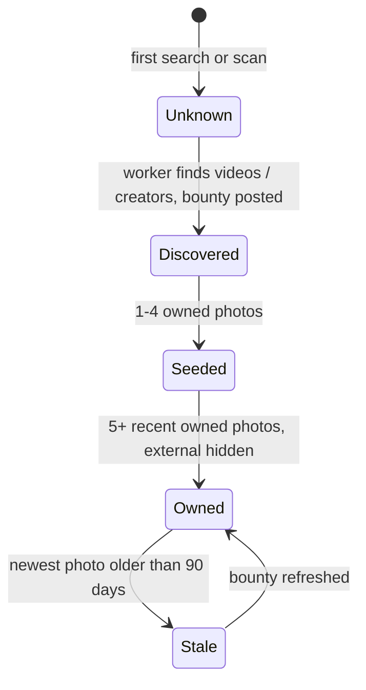

# 04: Image Acquisition and Cost

> **MVP v1:** photos come from **manual admin seeding** (photos we took or licensed) plus user uploads checked by the community. YouTube, Google Places, Openverse and web discovery are **deferred to Phase 2**. They are designed here so that bootstrapping never turns into a permanent dependency.

## Principle: find photos with APIs, own photos through people
Every external lookup has two jobs:
1. Fill a gap **temporarily**, with attributed, display-only content.
2. **Create a lead** (a creator to license from, or a bounty to post) that replaces the external source for good.

## 1. Sources compared
| Source | What you get for "Domino's Margherita" | Cost | Show? | Store? | Verdict |
|---|---|---|---|---|---|
| **Admin seed shoots** (v1) | Standard chain items; one photo is valid for every outlet of the brand | Cost of the food, ~₹150–400 per item | ✅ | ✅ | **v1 backbone** |
| **User uploads + community verification** (v1) | Ongoing, outlet-tagged supply | Bites + ~₹0.1 safety scan per photo | ✅ | ✅ | **Long-term flywheel** |
| **Paid seed bounties** (contract, UPI payout, licence + consent) | Fresh, rights-cleared, outlet-tagged photos | **₹15–30 per accepted photo** | ✅ | ✅ | Cheapest owned supply at scale |
| **Creator archive licensing** | 200–1,000 existing tagged photos per creator | ₹3k–10k per creator ≈ **₹5–20 per photo** | ✅ | ✅ | Fastest owned supply in bulk |
| YouTube `playlistItems.list` on ~50 local food channels | All uploads from those channels | **1 quota unit per 50 videos**, plus free push notifications for new uploads | Embed + thumbnail, `start=` | Metadata ≤30 days | **Main way to find YouTube videos** (Phase 2) |
| YouTube `search.list` | Review and vlog videos | 100 units per search against 10k/day ≈ **100 searches/day free** | Same | Same | Gaps only |
| **YouTube Creator Connect** (the creator links their channel with OAuth and signs a licence) | Timestamps + **frames the creator allows** | Bites / Pro / "featured creator" / small fee | ✅ | ✅ Per licence | Turns YouTube into **owned** images, legally |
| Google Places Text Search (IDs only) | `place_id` | **Free** | — | `place_id` forever | Outlet identity |
| Google Place Details (photos) + Place Photo | ≤10 outlet photos, **not tagged by dish** | Details Pro ~$17 per 1k (5k free/month); Photo ~$7 per 1k (verify) | ✅ With attribution, **on tap** | ❌ | Temporary; the default is a free deep link |
| Openverse / Wikimedia / Flickr CC | Generic dish photos | **Free** | ✅ With attribution | ✅ | "Similar item" tier |
| Brave Search API (web + images) | Mostly brand ads and stock photos | ~$5 per 1k (free monthly credit) | ❌ Link-outs only | ❌ | Finding creators to approach |
| Google Custom Search API | — | Shutting down 1 Jan 2027 | — | — | Don't use |
| Instagram oEmbed | Specific public posts | Free (Meta app review) | ✅ As embed | ❌ | Showcase creators found through outreach |

**Sources:**
- [YouTube quota](https://developers.google.com/youtube/v3/getting-started) · [YouTube policies](https://developers.google.com/youtube/terms/developer-policies)
- [Places billing](https://developers.google.com/maps/documentation/places/web-service/usage-and-billing) · [Places policies](https://developers.google.com/maps/documentation/places/web-service/policies)
- [Custom Search shutdown](https://developers.google.com/custom-search/v1/overview) · [Brave pricing](https://costbench.com/software/ai-search-apis/brave-search-api/) · [Openverse](https://openverse.org/about)

## 2. v1 seeding plan (chains, Bengaluru)
| Step | Detail |
|---|---|
| Catalog | 5 brands × ~40–60 items ≈ 250 items (CSV import) |
| Priority | The **top 100 items** by popularity (bestsellers on each brand's menu) |
| Target | **≥3 approved photos per top-100 item** before public launch ≈ 300+ photos |
| How | Team "shoot days": order, photograph in natural light on a plain surface, record the outlet where known |
| Cost | ~100 items × ~₹250 ≈ **₹25k in food**, one-time; the photos are fully owned |
| Tagging | `source = admin_seed`, `license_ref = 'team-shoot-YYYY-MM-DD'`; `outlet_id` when shot at a known outlet |
| Also | Ask friends and campus ambassadors to upload through the app, which exercises the verification flow early |

## 3. Pilot bootstrap budget (the broader pilot, Phase 1–2)
Target: ~150 item × outlet pairs × 5 photos ≈ **750 owned photos**.
| Channel | Share | Cost |
|---|---|---|
| Creator archive licensing (~5 creators) | ~40% | ~₹25k |
| Paid seed bounties (300 × ₹25) | ~40% | ~₹7.5k |
| Team shoots | ~20% | ~₹20k in food |
| Safety scans, Openverse, YouTube, Places free caps, Brave credits | — | < ₹1k |
| **Total** | | **≈ ₹55k (~$650), one-time, and fully owned** |

**Compare that with renting Google photos:** 10k result views/month × 5 photos ≈ 50k Place Photo calls ≈ **~₹30k every month**, and never owned. Owned photos pay for themselves in about 2 months.

## 4. Engineering mechanisms that keep costs down (Phase 2)
1. **Normalize first, fetch once.** External calls are keyed by `item_id` / `outlet_id`, never by the raw query. One lookup for a chain item serves every outlet of that brand.
2. **Background, not at request time.** Discovery runs in SQS workers at off-peak hours. User requests only read our database. The only exception is the Google photo strip, which loads on tap.
3. **Demand-driven.** We only look up launch-catalog items and items in the `demand_log` (searches or scans with no or weak results). No speculative crawling.
4. **Single-flight and negative cache.** Identical concurrent misses become one job. "No result" is cached for 7 days.
5. **YouTube quota:**
   - Channel upload playlists (1 unit) are the first choice; `search.list` (100 units) is reserved for gaps.
   - Refresh with `videos.list` (50 IDs per unit) within 30 days.
   - Get new uploads through free push notifications.
6. **Cheap checks first when classifying images:** metadata filter → pHash dedupe → SigLIP/CLIP zero-shot on the worker → an AI model **only for uncertain cases**, in batch mode (~50% off) through the AI Gateway ([02b](02b-ai-gateway.md)).
7. **Keep Google Places calls to a minimum:**
   - IDs-only lookups (free)
   - field masks
   - photos on tap only
   - a per-user daily cap
   - the deep link as the default.
8. **Graduation:** when an item × outlet pair has **≥5 recent owned photos**, its external sources are hidden behind "More from YouTube/Google" and make **no API calls unless tapped**.
9. **Every gap generates supply:** each uncovered search automatically opens or boosts a **bounty** and adds a **creator-outreach** task (from channels and bloggers found by discovery).
10. **KPI: the external dependency ratio** = results served from Tier 3 ÷ all results. Target **< 50% at launch, < 20% by month 6**. Also track **external API ₹ per 1k searches**.

## 5. Lifecycle of an item × outlet pair

**What the user sees in each state:**
- *Unknown:* "No real photo yet" · YouTube moments (if indexed) · Google strip (tap) · "Similar item" CC photos · "Request this dish"
- *Seeded:* our photos first, external below
- *Owned:* our photos only (external behind a tap).

## 6. YouTube channel index (Phase 2 design)
1. **Seed list:** ~50 Bengaluru/India food channels, curated by hand plus found through `search.list` over a few days of quota.
2. **Ingest:** for each channel, pull its uploads playlist with `playlistItems.list` (1 unit per 50 videos).
3. **Classify:** the AI Gateway `classifyVideoMeta` runs over title, description and chapters, and outputs `{brand?, items[], outlet_hint?, timestamps[]}` in batch mode.
4. **Store:** `external_media` rows with `expires_at` ≤30 days; refreshed via `videos.list`.
5. **Timestamps:** from description chapters, or **user-tagged** ("dish appears at 2:31", earns Bites when confirmed by the community).
6. **Display:** the embedded player at `start=`, with YouTube attribution. **Never frames.**
7. **Outreach:** channels with the most matches go into the Creator Connect pipeline.

## 7. Creator Connect (Phase 2 design)
- **Offer:** "Feature your food videos and photos on Real Dish." Creators get a featured profile with a link back to their channel or handle, Bites or Pro, and optionally a small fee per licensed photo.
- **Flow:**
  1. The creator signs in and connects YouTube (OAuth) or Instagram.
  2. They accept a **licence**: scope (display in app and web), term, territory, derivatives (crops/resizes), training (optional), revocation.
  3. They tag items and outlets, and approve frames at timestamps. Frames are extracted **only for licensed videos**, using the creator's own file upload or an approved extraction.
- **Result:** Tier 2 photos with `license_ref`, owned for the licence term.

## 8. Paid seed bounties (Phase 1–2)
- **Contract contributors** (students, food lovers) paid by UPI per **accepted** photo, under a written licence plus consent. This is separate from in-app Bites.
- **Targets come from coverage gaps:** "Taco Bell Crunchwrap, Koramangala: 3 photos needed".
- **Same pipeline:** safety scan → community verification → approval → payout.
