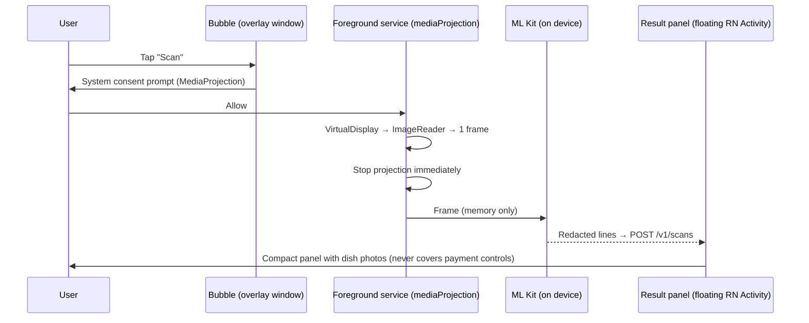

# 05: Screenshot Scan, Floating Bubble and iOS Paths

## Summary
| Path | Platform | Phase | How it reads the screen |
|---|---|---|---|
| **Share a screenshot** | Android (iOS later) | **v1** | The user shares an image → **ML Kit OCR on device** |
| "Scan a screenshot" (in-app picker) | Android / iOS | **v1** | Same pipeline |
| Floating bubble | **Android only** | 3 | Tap → MediaProjection consent → **one frame** → OCR on device → stop |
| Quick Settings tile | Android | 3 | Same as the bubble |
| Share Extension / Shortcut | iOS | 4 | Share or Back Tap → screenshot → app |
| Visual Intelligence integration | iOS 26+ | 4 | Apple's system feature calls our App Intents |

**Rules for every path:**
- the screenshot never leaves the device by default
- only redacted text lines are sent
- no background capture, ever
- no AccessibilityService.

## 1. v1: screenshot share (deterministic, no AI)
The full spec, sequence diagram and screens are in [00 §4.10](00-mvp-v1-spec.md#410-screenshot-share). In short:
1. **Receive:** `expo-share-intent` registers an `image/*` share target (dev build). Expo Router's `+native-intent` routes to `/scan`.
2. **OCR:** `@react-native-ml-kit/text-recognition` returns blocks → lines → bounding boxes.
3. **Redact on the device:** drop phone numbers, emails, OTPs, order IDs and lines under 3 characters.
4. **Send:** `POST /v1/scans { entry, lines[{text, h}], context:{ lat?, lng?, areaId?, countryCode? } }`. A place named in the screenshot outranks the user's home area for this query ([12 §7](12-geography-and-relevance.md)).
5. **`CatalogScanParser`:**
   - brand by aliases and trigram match
   - items by trigram match over items plus `item_aliases`, weighted by text prominence
   - outlet by locality, then nearest branch, then brand-level.
6. **Show:** a confident match opens the dish page ("Not right?"); otherwise the "Which dish?" chooser.
7. **Learn:** `POST /v1/scans/:id/select` → tune aliases and thresholds.

**Why no AI in v1:** the catalog is 5 brands and ~250 items. Deterministic matching is free, fast, private and testable. The `ScanParser` interface lets the `AiScanParser` ([02b](02b-ai-gateway.md)) slot in later.

### Typical screenshot sources and cues
| Source app | Brand cue | Dish cue | Outlet cue |
|---|---|---|---|
| Zomato / Swiggy restaurant page | Restaurant name at the top | Item names in the menu list, largest text on the item sheet | Locality under the restaurant name |
| Domino's / Pizza Hut / BK / Taco Bell apps | Often **no brand text** (it's their own app), so the brand is inferred from matched items | Item name on the product page | Selected store name, sometimes |
| Cart / checkout | Restaurant name | Several items | Delivery address: **redacted, never used** |

When the brand is missing, items are matched across all brands. If an item name is unique to one brand ("Crunchwrap Supreme" is Taco Bell), that sets the brand.

### Accuracy plan
- **Eval set:** 60–100 labelled screenshots → `pnpm scan:eval`, which reports top-1 and top-3 overall and per source app.
- **Targets:** top-1 ≥85%, top-3 ≥95%, p95 < 1.5 s.
- **Improvement levers:** item aliases (misspellings, regional names, size suffixes), brand aliases, stop-word lists (e.g. "Add", "Customise", "Bestseller"), prominence weighting.

## 2. Phase 3: Android floating bubble

### What's possible
- **Drawing** over other apps: yes, with a `TYPE_APPLICATION_OVERLAY` window and the `SYSTEM_ALERT_WINDOW` permission, which the user grants in Settings.
- **Reading** other apps: **no**. The only acceptable way to see pixels is **MediaProjection**, which shows a system consent prompt for **each capture session**. On current Android versions it needs a `mediaProjection` foreground service, and Android 14+ shows the capture indicator.

### Design

**Implementation (Kotlin Expo Module + config plugin, `modules/overlay`):**
- `OverlayService`: a draggable bubble, snapping to the screen edge, dismissible by dragging to a ✕ target.
- `CaptureService` (foreground service type `mediaProjection`): gets **one frame** per consented session, then `stop()`.
- **The result panel is a React Native Activity** with a translucent, floating theme (~40% width, a side or bottom sheet), so the UI reuses the RN screens. Holding the overlay permission allows starting it from the background.
- **Quick Settings `TileService`:** a no-bubble alternative with the same capture flow.

### Safety requirements (from the base report)
- Capture **only** after an explicit tap. No background capture, no notification reading, **no AccessibilityService**.
  - Play requires prominent disclosure for AccessibilityService, and Android 17 revokes it for non-accessibility apps under Advanced Protection.
  - Sources: [Play policy](https://support.google.com/googleplay/android-developer/answer/10964491), [Android 17](https://thehackernews.com/2026/03/android-17-blocks-non-accessibility.html).
- Block or skip scans on known payment and login screens where detectable. Screens with `FLAG_SECURE` capture as black, so show "This app doesn't allow scanning".
- Respect apps that hide overlays (tapjacking protection). Never cover purchase or payment controls.
- An explanation screen before asking for the overlay permission, and a clear "what is and isn't kept" note.
- **Manual search always gives the same value.** The bubble speeds things up; it's never the only way.
- Play review package: a demo video, foreground-service justification, permission declarations, Data safety answers.

## 3. Phase 4: iOS paths
- **No overlay, and no reading other apps' screens.** Don't advertise an Android-style bubble.
- **Share Extension** (the same `expo-share-intent` library): share a screenshot → Real Dish.
- **Shortcut / App Intent:** "Find real photos" takes the latest screenshot. Users can bind it to **Back Tap**.
- **Visual Intelligence (iOS 26+):**
  - implement an `IntentValueQuery` that accepts a `SemanticContentDescriptor` and returns dish `AppEntity` results (title, subtitle, thumbnail)
  - Real Dish results then appear when the user runs Visual Intelligence on a screenshot or camera view
  - needs Apple Intelligence-capable devices.
  - Source: [WWDC25: App Intents](https://developer.apple.com/videos/play/wwdc2025/275/).

## 4. Metering (when the paywall arrives)
- A **scan** is any screenshot, bubble or visual-intelligence lookup. Text search is never metered.
- The `scans` table already records each one per user, so free quotas (e.g. 3/month) are enforced server-side through `usage_counters` ([08](08-monetization-and-unit-economics.md)).
