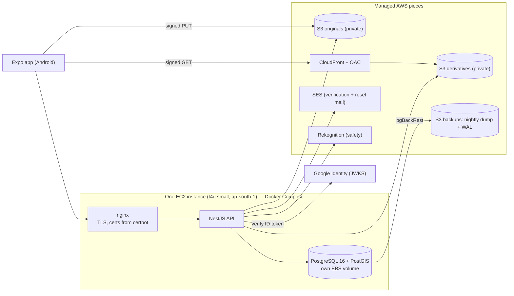
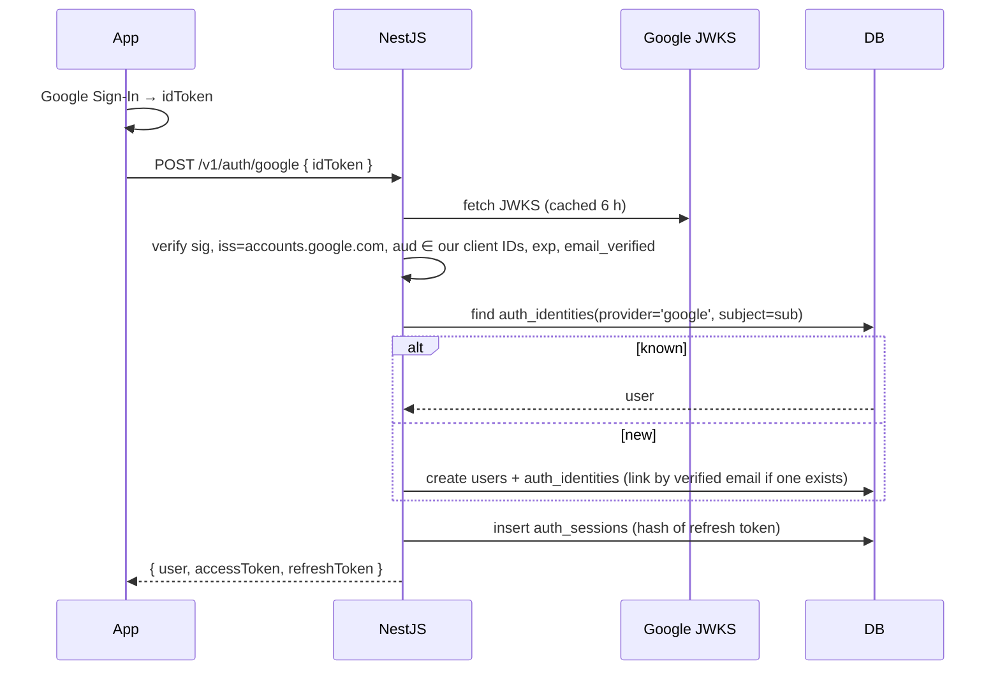

# 11: Backend MVP v1 — self-hosted auth, data model and API

> **Decision (Sept 2026): everything is ours, on AWS.** No Supabase, no Cognito. Sign-in is Google Sign-In verified by our own API, plus email + password we store ourselves. One NestJS service owns every write.
>
> This doc supersedes the Cognito parts of [00 §5–6](00-mvp-v1-spec.md) and [02](02-architecture.md). The product scope is unchanged.
>
> **Geography ([12](12-geography-and-relevance.md)):** identity is global, geography is relevance. Three linked tables — `countries` → `states` → `cities` — plus `user_locations` for where a user is. There is no city boundary anywhere below: every geographic parameter is optional and results fall back outward rather than coming back empty. Tier scores and the ranking formula live in [12 §3](12-geography-and-relevance.md); this doc holds the schema and the API.

## 1. Shape



**One box, on purpose.** nginx terminates TLS and proxies to the API; the API and Postgres are containers beside it. Everything with real operational value that AWS gives away cheaply — object storage, CDN, mail, backups — stays managed. What we self-host is the part that would otherwise cost $35/month in load balancer and RDS fees while serving a few hundred users.

**Why one service:** every rule that matters — Bites, approvals, evidence labels, scan quota — lives behind one door. Background work runs inside the same process off a `jobs` table (§6), so there's no SQS, EventBridge or worker service to pay for yet.

**What we give up, plainly:** no automatic failover, deploys blip for a second or two, and **backups are now our job, not Amazon's** (§7.2). That's an acceptable trade before seed, and §7.6 says exactly when to undo it.

## 2. Authentication (ours)

### 2.1 Tokens

| Token | Form | Lifetime | Stored |
|---|---|---|---|
| **Access** | JWT, HS256, secret in SSM Parameter Store, `kid` header for rotation | 15 min | Never stored. Claims: `sub` (our `users.id`), `sid` (session id), `iat`, `exp`, `ver` (token version) |
| **Refresh** | 32 random bytes, base64url — opaque, not a JWT | 60 days, rolling | Only its SHA-256 lands in `auth_sessions`. The raw value lives in the app's `expo-secure-store` |

The app sends `Authorization: Bearer <access>`. On 401 it calls `/v1/auth/refresh` **once, behind a single-flight promise** — concurrent 401s wait on the same refresh — then retries.

**What every authenticated request checks.** The JWT signature and expiry alone are not enough. One indexed query joins `auth_sessions` (by `sid`) to `users` (by `sub`) and the request is rejected unless **all** of:

| Check | Rejects |
|---|---|
| `auth_sessions.revoked_at is null` and not expired | a logged-out or revoked session |
| `users.token_version = jwt.ver` | everything, after a password reset or a "sign out everywhere" |
| `users.status = 'active'` | suspended and deleted accounts |
| `users.role` (read here, never from the token) | a demoted admin |

**No caching in v1.** That query is a primary-key join costing well under a millisecond, and caching it is what creates the "role changes are immediate, except for 30 seconds" contradiction. If p99 ever suffers, cache **non-privileged reads only**, for ≤ 5 s, and always bypass the cache for writes, admin routes and anything that reads `role`.

**Rotation, without punishing normal concurrency.** Every refresh issues a new pair, marks the old row `rotated_to` and `rotated_at`, and runs inside `SELECT … FROM auth_sessions WHERE refresh_token_hash = $1 FOR UPDATE`, so two simultaneous refreshes serialize instead of racing.

A rotated token presented again is then judged by when and how often:

| Situation | Response |
|---|---|
| Rotated **< 60 s ago**, and the successor has not itself been rotated, and `replays < 3` | Treat as a lost response, not theft: issue a fresh pair from the same chain node, increment `replays`. No revocation. |
| Rotated longer than 60 s ago, or the successor already rotated, or `replays >= 3` | **Theft.** Revoke the whole chain for that user, write `audit_logs`, force a new sign-in. |

Two dropped-response cases are what make the grace window necessary: the client rotates successfully but never receives the reply, and two screens refresh in the same instant. Both are ordinary; neither should sign the user out. `auth_sessions` therefore also carries `rotated_at` and `replays smallint default 0`.

**Accepted tradeoff, stated plainly.** The 60-second window does weaken strict replay detection: a token stolen and replayed inside that window, before the real client retries, is accepted once instead of revoking the chain. We take that trade because signing people out on a flaky mobile network is a frequent, guaranteed harm, while this is a narrow one — the attacker needs the token within a minute of its rotation, and any later use still revokes everything. It is not free, so it is watched:

- every replay writes an `audit_logs` row (`auth.refresh_replay`) with session id, IP hash and user agent
- alarms on a spike in replays, on a replay whose IP hash differs from the rotation that preceded it, and on every `replays >= 3` revocation
- if production shows those alarms are quiet, shorten the window to 15 s; if the client's single-flight refresh proves reliable across app restarts, drop it entirely.

### 2.2 Google Sign-In (no Amplify, no Cognito)

The app uses `@react-native-google-signin/google-signin` to get a Google **ID token**, and that's all Google is involved in.



Server-side verification is what makes this safe: anyone can post a token, but only Google can sign one for our `aud`. Both the Android client ID and the web client ID are accepted (Android Google Sign-In issues against the web one).

### 2.3 Email + password (ours)

- **Hash:** Argon2id via **`@node-rs/argon2`** (Rust, prebuilt binaries — no C compiler in the Docker build), `memory 19 MiB, iterations 2, parallelism 1`, per-hash salt, stored in `users.password_hash`. The encoded string carries its own parameters, so raising the cost later is a re-hash on next login, not a migration.
  - Wrap it in a `PasswordHasher` interface (`hash`, `verify`, `needsRehash`). Nothing else in the codebase names the algorithm.
  - **Tune to the box:** aim for ~100 ms per hash on the t4g.small; measure, don't copy numbers.
  - **Rate-limit before hashing** (the lockout rule below), so a login flood can't burn our CPU.
  - Never bcrypt-by-default, never plain SHA.
- **Password rules:** ≥ 10 characters, trimmed, not in a small blocklist of obvious ones. No composition rules and no forced rotation.
- **Verification and reset are 6-digit codes**, not links — the app is where the user already is. Codes are stored as SHA-256 in `auth_tokens`, valid 15 minutes, 5 attempts, single use. Sent by SES.
- **A reset consumes all sessions** (`revoked_at = now()` on every row for that user).
- **Enumeration:** `/auth/register`, `/auth/login` and `/auth/password/forgot` return the same shape and timing whether or not the email exists.
- **Lockout:** 5 failed logins per email in 15 min → 15 min lock; 20 per IP per hour → 429. Recorded in `login_attempts`.

### 2.4 Linking

One person, one `users` row, many `auth_identities`. Signing in with Google using an email that already has a verified password account **links** to it. An unverified one doesn't link (it would let someone claim an account by registering the address first).

## 3. Data model

PostgreSQL 16 with `postgis`, `pg_trgm`, `citext`, `pgcrypto` (no `ltree` — the geography hierarchy is three tables, not a path). UUID v7 primary keys generated by the app (time-ordered, index-friendly). Every table has `created_at timestamptz`; mutable ones also `updated_at`. Migrations are SQL-first, via Drizzle, in the repo.

### 3.1 Identity

| Table | Columns |
|---|---|
| `users` | `id` PK · `email citext unique not null` · `email_verified bool` · `password_hash text null` (null = Google-only) · `display_name` · `avatar_asset_id → media_assets` · `role text check (user, moderator, admin) default 'user'` · *(no home column — where a user is lives in `user_locations`, §3.2)* · `theme_pref text default 'system'` · `status text check (active, suspended, deleted)` · `token_version int default 0` · `last_login_at` · `created_at` · `updated_at` · `deleted_at` |
| `auth_identities` | `id` PK · `user_id` FK · `provider text check (google, password)` · `provider_subject text` (Google `sub`) · `email citext` · `email_verified bool` · `linked_at` · `last_used_at` · **unique (provider, provider_subject)** |
| `auth_sessions` | `id` PK · `user_id` FK · `refresh_token_hash text unique` · `issued_at` · `expires_at` · `revoked_at` · `rotated_to uuid null` · **`rotated_at`** · **`replays smallint default 0`** · `platform` · `app_version` · `device_label` · `ip_hash` · `user_agent` · `last_used_at` — index `(user_id) where revoked_at is null`. The last two drive the grace window in §2.1 |
| `auth_tokens` | `id` PK · `user_id` FK · `purpose text check (email_verify, password_reset)` · `code_hash text` · `attempts smallint` · `expires_at` · `consumed_at` · `created_at` |
| `login_attempts` | `id bigserial` · `email citext null` · `ip_hash text` · `outcome text check (success, bad_password, unknown_email, locked)` · `created_at` — indexes `(email, created_at)`, `(ip_hash, created_at)`; pruned after 30 days |
| `consents` | `id` PK · `user_id` FK · `kind text check (terms, privacy, photo_display, photo_commercial, photo_training, location)` · `version text` · `granted_at` · `revoked_at` |

### 3.2 Catalog — the menu belongs to the brand

| Table | Columns |
|---|---|
| `countries` | `id` PK · `iso2 char(2) unique` · `iso3 char(3) unique` · `name` · `slug citext unique` · `phone_code` · `currency char(3)` · `center geography(Point,4326)` · `is_launched bool` — trigram index on `name` |
| `states` | `id` PK · `country_id` FK · `code` (ISO 3166-2 suffix) · `name` · `slug citext` · `kind text default 'state'` (state, union_territory, province, region) · `center` · `is_launched bool` — unique `(country_id, slug)` and `(id, country_id)`, trigram index on `name` |
| `cities` | `id` PK · `country_id` FK · **`state_id` null** (city-states have none) · `name` · `slug citext` · `center geography(Point,4326) not null` · `timezone` · `is_launched bool` — unique `(country_id, slug)` and `(id, country_id)`, **composite FK `(state_id, country_id) → states(id, country_id)`**, trigram index on `name` |
| `user_locations` | `id` PK · `user_id` FK *(added with `users`)* · `kind text check (home, last_seen)` · `source text check (device_precise, device_approximate, picked_city, picked_state, picked_country, screenshot, inferred_locale, inferred_ip)` · `confidence smallint 0-100` · `country_id`, `state_id`, `city_id` FK null · **`point geography(Point,4326) null` — private, never returned** · `accuracy_m` · `captured_at` — unique `(user_id, kind)`, composite FKs keeping city and state inside `country_id`, and a check that at least one of the four is present. `last_seen` is what a search reads first; `home` is the fallback ([12 §2.3](12-geography-and-relevance.md)) |
| `brands` | `id` PK · `slug citext unique` · `name` · `brand_type text check (chain, independent)` · `logo_asset_id` · `cover_asset_id` · `accent_color` · `is_featured bool` · `featured_rank int` · `status text check (draft, active, archived)` — trigram index on `name` |
| `brand_aliases` | `brand_id` FK · `alias citext` — PK `(brand_id, alias)`, trigram index |
| `outlets` | `id` PK · `brand_id` FK · **`country_id` FK not null** (the only level required) · **`state_id`, `city_id` FK null** · `name` · `locality` · `address` · `postal_code` · **`location geography(Point,4326) null`** (an outlet known only from a screenshot has no coordinates) · **`geo_source text check (admin, places, screenshot, inferred)`** · **`geo_confidence smallint`** · `google_place_id text unique null` · `status text check (draft, active, closed)` — composite FKs `(city_id, country_id)` and `(state_id, country_id)`, GiST index on `location`, indexes `(city_id, brand_id)` and `(country_id, brand_id) where status='active'` |
| `item_categories` | `id` PK · `brand_id` FK · `name` · `sort_order` |
| `items` | `id` PK · `brand_id` FK · `category_id` FK null · `slug citext` · `name` · `description` (ours, never brand ad copy) · `attributes jsonb` (`{diet, sizes}`) · `status text check (active, draft, discontinued)` — unique `(brand_id, slug)`, trigram index on `name` |
| `item_aliases` | `item_id` FK · `alias citext` — PK `(item_id, alias)`, trigram index |
| `outlet_items` | `outlet_id` FK · `item_id` FK · **`brand_id` FK** (carried so both composite FKs in §3.2 can check it) · `is_available bool` · `price_minor int null` — PK `(outlet_id, item_id)`. **No row = inherits the brand menu.** |
| `brand_markets` | `brand_id` FK · `geo_area_id` FK · `local_name` · `is_active bool` — PK `(brand_id, geo_area_id)`. Presence and local naming per market |
| `item_markets` | `item_id` FK · `geo_area_id` FK · `is_available bool` · `name_override` · `price_minor` · `currency char(3)` · `source text check (admin, menu_scan, merchant, inferred)` · `updated_at` — PK `(item_id, geo_area_id)`. **The menu item itself never forks by country** ([12 §2.2](12-geography-and-relevance.md)) |
| `item_suggestions` | `id` PK · `user_id` · `brand_id` · `outlet_id null` · `suggested_name` · `status text check (pending, accepted, rejected)` · `created_item_id null` · `reviewed_by` · `reviewed_at` |

**Brand consistency is enforced by the database, not by hope.** Nothing above stops an item from Domino's being paired with a Pizza Hut outlet, so composite keys close it:

```sql
-- targets for the composite references
alter table brands           add constraint brands_id_key unique (id);
alter table item_categories  add constraint item_categories_id_brand_key unique (id, brand_id);
alter table outlets          add constraint outlets_id_brand_key unique (id, brand_id);
alter table items            add constraint items_id_brand_key unique (id, brand_id);

-- a category must belong to the item's own brand
alter table items add constraint items_category_same_brand
  foreign key (category_id, brand_id) references item_categories (id, brand_id);

-- outlet_items carries brand_id so both sides are checked
alter table outlet_items add constraint outlet_items_outlet_brand
  foreign key (outlet_id, brand_id) references outlets (id, brand_id);
alter table outlet_items add constraint outlet_items_item_brand
  foreign key (item_id, brand_id) references items (id, brand_id);

-- a photo's item and outlet must be the same brand as the photo
alter table photos add constraint photos_item_same_brand
  foreign key (item_id, brand_id) references items (id, brand_id);
alter table photos add constraint photos_outlet_same_brand
  foreign key (outlet_id, brand_id) references outlets (id, brand_id);  -- null outlet_id passes
```

`outlet_items` therefore gains a `brand_id` column, and `photos.brand_id` stops being a convenience denormalization and becomes the thing that ties item and outlet together. `photos_outlet_same_brand` is satisfied automatically when `outlet_id` is null, which is what brand-level photos need.

**Menu facts resolve most-specific-first:** `outlet_items` → `item_markets` at city → region → country → the item's own defaults. `items` and `brands` carry no geography at all, so "Domino's Margherita" stays one row worldwide.

### 3.3 Media and photos

| Table | Columns |
|---|---|
| `media_assets` | `id` PK · `kind text check (item_photo, brand_logo, brand_cover, avatar)` · `storage_provider text default 's3'` · `bucket` · `object_key text unique` · `mime_type` · `width` · `height` · `bytes` · `sha256 text` (exact-duplicate check) · `phash bigint null` · `owner_user_id null` · `status text check (staged, stored, deleted)` · `derivatives_ready bool` |
| `photos` | `id` PK · `asset_id` FK · `item_id` FK · `brand_id` FK (denormalized) · `outlet_id` FK **null** · `uploader_user_id null` · `source text check (admin_seed, user_upload, licensed, merchant)` · `rights_tier smallint` · `license_ref` · `capture_mode text check (camera, gallery)` · `captured_at` · **`capture_location geography(Point,4326) null` — private, never returned** · `status text check (pending, in_review, escalated, approved, rejected, removed)` · `rejection_reason` · `reviewed_by` · `reviewed_at` · **`country_id`, `state_id`, `city_id` FK** (denormalized from the outlet, or from the uploader's context for brand-level photos; trigger-filled — ranking must not join per row) · **`geo_source`**, **`geo_confidence smallint`** · `is_cover bool` · `helpful_count int` · `safety jsonb` (normalized scanner verdict) — indexes `(item_id, city_id, created_at desc)`, `(item_id, state_id, created_at desc)`, `(item_id, country_id, created_at desc)`, `(item_id, created_at desc)` all `where status='approved'`, plus `(outlet_id, item_id) where status='approved'` and `(status, created_at)` |
| `photo_helpful` | `photo_id` FK · `user_id` FK · `created_at` — PK `(photo_id, user_id)` (one vote each; `helpful_count` is a trigger-maintained counter) |
| `photo_reports` | `id` PK · `photo_id` · `reporter_id` · `reason text check (not_this_item, not_real, offensive, copyright, privacy, other)` · `note` · `status text check (open, actioned, dismissed)` · `resolved_by` · `resolved_at` |
| `photo_appeals` | `id` PK · `photo_id` · `user_id` · `note` · `status text check (open, upheld, rejected)` · `resolved_by` · `resolved_at` — one per photo |

### 3.4 Community verification

| Table | Columns |
|---|---|
| `verification_tasks` | `id` PK · `photo_id` FK · `status text check (open, resolved, escalated)` · `is_gold bool` · `gold_answer text null` **(never sent to clients)** · `community_outcome` · `final_outcome` · `decided_by text check (admin, consensus)` · `vote_count smallint` · `resolved_at` — index `(created_at) where status='open'` |
| `verification_votes` | `id` PK · `task_id` FK · `voter_id` FK · `answer text check (yes, wrong_item, not_real, inappropriate, unsure)` · `suggested_item_id null` · `weight numeric(3,2)` (snapshot at vote time) · `matched_outcome bool null` — unique `(task_id, voter_id)` |
| `verifier_stats` | `user_id` PK · `calibrated_at` · `votes` · `gold_seen` · `gold_correct` · `weight numeric(3,2) default 0.5` · `updated_at` |
| `verification_assignments` | `task_id` FK · `user_id` FK · `assigned_at` · `expires_at` · `status text check (open, voted, expired)` — PK `(task_id, user_id)`, index `(user_id) where status='open'` |

**One live task per photo:**
```sql
create unique index verification_tasks_one_open
  on verification_tasks (photo_id) where status in ('open', 'escalated');
```
A retry of "create the task" can therefore never produce two.

### 3.5 Rewards and telemetry

| Table | Columns |
|---|---|
| `credit_ledger` | `id bigserial` PK · `user_id` FK · `delta int` · `reason text check (upload_approved, pioneer_bonus, verify_vote, admin_adjust, reversal, spend)` · `ref_type` · `ref_id` · `status text check (pending, available, reversed)` · `available_at` · `expires_at` · **`idempotency_key text unique`** — append-only (an `UPDATE`/`DELETE` trigger raises) |
| `credit_balances` | view: `available`, `pending` per user |
| `scans` | `id` PK · `user_id` FK · `entry text check (share_intent, in_app_picker, overlay)` · `parser text` (`catalog_v1`) · `detected_brand_id` · `detected_outlet_id` · **`detected_area_id`** · **`context jsonb`** (the resolved location signals and their confidences — [12 §2.3](12-geography-and-relevance.md), ids only) · `candidates jsonb` (`[{item_id, score}]`) · `selected_item_id` · `auto_opened bool` · `latency_ms` — **no screenshot, no raw OCR text** |

Monthly scan quota is `count(*) from scans where user_id = $1 and created_at >= date_trunc('month', now())`. No counter table.

### 3.6 Operations

| Table | Columns |
|---|---|
| `item_coverage` | `item_id` FK · `level text check (city, state, country)` · `area_id uuid` (no FK — this is a derived counter, and a polymorphic key is fine for a cache, not for facts) · `approved_count int` · `newest_at` — PK `(item_id, level, area_id)`, trigger-maintained on photo approval. Answers "how much local evidence exists" without scanning `photos`, and drives tier selection and cache invalidation |
| `audit_logs` | `id bigserial` · `actor_user_id` · `action` · `entity_type` · `entity_id` · `metadata jsonb` · `ip_hash` · `created_at` — every admin and moderation action |
| `jobs` | `id` PK · `type` · `payload jsonb` · **`dedupe_key text`** · `run_at` · `attempts` · `max_attempts default 5` · `status text check (queued, running, done, failed)` · `locked_by` · `locked_at` · **`lease_expires_at`** · `last_error` · `created_at` · `finished_at` — see §6 |

```sql
-- at most one live job per logical unit of work
create unique index jobs_dedupe on jobs (dedupe_key)
  where status in ('queued', 'running') and dedupe_key is not null;
create index jobs_claimable on jobs (run_at) where status in ('queued', 'running');
```

## 4. API (`/v1`)

Auth column: **—** public · **U** signed-in user · **A** `moderator`/`admin`.

### Auth
| | Endpoint | Purpose |
|---|---|---|
| — | `POST /v1/auth/google` | `{ idToken }` → verify with Google, create or link user, issue tokens |
| — | `POST /v1/auth/register` | `{ email, password, displayName }` → user + verification code by mail |
| — | `POST /v1/auth/verify-email` | `{ email, code }` → verified, tokens issued |
| — | `POST /v1/auth/resend-verification` | Rate-limited to 1/min, 5/day |
| — | `POST /v1/auth/login` | `{ email, password }` → tokens |
| — | `POST /v1/auth/refresh` | `{ refreshToken }` → new pair (rotating, reuse-detecting) |
| U | `POST /v1/auth/logout` | Revokes this session; `?all=true` revokes every session |
| — | `POST /v1/auth/password/forgot` | Always 204 |
| — | `POST /v1/auth/password/reset` | `{ email, code, newPassword }` → revokes all sessions |
| U | `POST /v1/auth/password/change` | `{ currentPassword, newPassword }` — sets a password on a Google-only account too |

### Me
| | Endpoint | Purpose |
|---|---|---|
| U | `GET /v1/me` · `PATCH /v1/me` | Profile, `displayName`, `themePref`, and the home location as `{ cityId? , stateId?, countryId? }` → a `user_locations` row with `kind='home'`. Omitting it entirely is valid |
| U | `DELETE /v1/me` | Starts deletion — see §4.1 |
| U | `POST /v1/me/consents` | Grant or revoke a consent version |
| U | `GET /v1/me/photos` | Upload history with status |
| U | `GET /v1/me/credits` | Balance + paginated ledger |
| U | `GET /v1/me/verify-stats` | Votes, accuracy, weight |

### Catalog (read)
| | Endpoint | Purpose |
|---|---|---|
| — | `GET /v1/health/live` | Liveness: the process answers. Never touches the database; used by the Docker `healthcheck` |
| — | `GET /v1/health` (alias `/v1/health/ready`) | Readiness: database reachable (a `select 1`, 2 s timeout), and once migrations exist, latest migration applied. Uses `@nestjs/terminus`'s response shape (`{ status, info, error, details }`), with **`503`** when any check fails. Error bodies carry a fixed message, never driver text. This is what the external uptime check and its alarm watch (§7.3) |
| — | `GET /v1/geo/countries` · `GET /v1/geo/states?countryId=` · `GET /v1/geo/cities?countryId=&stateId=&q=` | One resource per table. Launched areas sort first; un-launched ones are still selectable |
| — | `GET /v1/geo/search?q=` | What the picker calls: `{ countries[], states[], cities[] }` in one round trip, each row carrying its resolved `path` |
| — | `GET /v1/geo/resolve?lat=&lng=` | Coordinates → `{country, region, city, confidence}` |
| U | `POST /v1/geo/resolve` | Screenshot signals → resolved context + confidence ([12 §2.3](12-geography-and-relevance.md)) |
| U | `GET /v1/home?cityId=&stateId=&countryId=&lat=&lng=` | Featured brands, outlets ranked by tier, banners. **Every geographic parameter is optional**; with none, results are global |
| — | `GET /v1/brands` · `GET /v1/brands/:slug?countryId=&cityId=&lat=&lng=` | Brand list; brand menu (resolved through `item_markets`, which is country-level) + its outlets, nearest tier first |
| — | `GET /v1/outlets?cityId=&stateId=&countryId=&brandId=&lat=&lng=&radiusM=` | Outlets under any level, or nearest-first |
| — | `GET /v1/outlets/:id` | Outlet, categories, items with cover photo, counts, evidence label |
| — | `GET /v1/items/:id/photos?outletId=&cityId=&stateId=&countryId=&scope=auto\|outlet\|city\|state\|country\|global&cursor=` | **Grouped** gallery: `{ groups: [{tier, label, cityId?/stateId?/countryId?, photos[]}] }`, tiers 0–4, each photo carrying its computed evidence label. `scope` is a hint that shifts which tier leads — never a filter. Empty tiers are omitted; the global tier keeps the screen non-empty |
| — | `GET /v1/search?q=&cityId=&countryId=&lat=&lng=` | Global search, locally ranked. Each result carries `geo: {tier, label, path}` |

### Upload and photos
| | Endpoint | Purpose |
|---|---|---|
| U | `POST /v1/uploads/presign` | Checks consent, quota and rate limit → a **presigned POST** (see §4.2): `{ assetId, url, fields }`, valid 5 min, key `staging/<userId>/<assetId>`, `content-length-range 1024–10485760`, content-type restricted to `image/jpeg` and `image/webp` |
| U | `POST /v1/photos` | `{ assetId, itemId, outletId?, captureMode, capturedAt, location?, consents }` → **validates the uploaded bytes** (§4.2) before anything else, then safety scan, then `in_review` + task, or `escalated` |
| U | `POST /v1/photos/:id/report` · `POST /v1/photos/:id/helpful` · `POST /v1/photos/:id/appeal` | Community signals; appeal allowed once |
| U | `POST /v1/item-suggestions` | "My dish isn't on the menu" |

### Verification
| | Endpoint | Purpose |
|---|---|---|
| U | `GET /v1/verify/eligibility` · `POST /v1/verify/calibration` | Tutorial gate |
| U | `GET /v1/verify/next?count=10` | **Reserves** tasks, it doesn't just read them (§4.3): never your own uploads, never your referrals, ≤ 3 per uploader per day, ~1 in 5 gold — **the response never reveals which** |
| U | `POST /v1/verify/:taskId/vote` | One vote; recomputes weighted consensus; in v1 that outcome is recorded, not applied |

### Scan
| | Endpoint | Purpose |
|---|---|---|
| U | `POST /v1/scans` | `{ entry, lines:[{text,h}], context:{ lat?, lng?, cityId?, countryId? } }` → `{ scanId, brand?, outlet?, detectedContext:{signals[], resolved, confidence}, candidates[], autoOpen }`. **A location read from the screenshot outranks the user's home** for this query only |
| U | `POST /v1/scans/:id/select` | Confirmed dish — the accuracy signal |

### Admin
| | Endpoint | Purpose |
|---|---|---|
| A | `GET/POST/PATCH /v1/admin/{brands,outlets,categories,items,geo/countries,geo/states,geo/cities}` | Catalog CRUD, plus a merge tool for duplicate rows |
| A | `POST /v1/admin/imports/{outlets,items}` | CSV import |
| A | `POST /v1/admin/photos/bulk` | Seed upload (`source=admin_seed`) |
| A | `GET /v1/admin/photos?status=in_review\|escalated&sort=community` | Moderation queue with the community tally |
| A | `POST /v1/admin/photos/:id/{approve,reject,retag}` | **One transaction:** photo status → task resolved → each vote's `matched_outcome` → ledger rows for uploader and matching verifiers → audit log |
| A | `POST /v1/admin/verify/gold` | Mark a decided photo as a gold task |
| A | `GET /v1/admin/metrics` | Coverage, agreement, time-to-decision, verifier accuracy |
| A | `GET /v1/admin/reports` · `POST /v1/admin/reports/:id/{action,dismiss}` | Report queue |

### 4.1 What "delete my account" actually does

Immediately: `users.status = 'deleted'`, `deleted_at = now()`, every session revoked, `token_version` incremented, `auth_identities` rows deleted (so the Google account can sign up fresh), and the account stops appearing anywhere.

After 30 days a purge job runs, and this is the part that needs to be explicit:

| Data | What happens | Why |
|---|---|---|
| `email` | Replaced with a tombstone (`deleted-<uuid>@invalid.realbite.in`) and `password_hash` nulled | The unique index would otherwise block that person from ever signing up again |
| `display_name`, avatar | Nulled; the avatar asset is deleted from S3 | No longer needed |
| `auth_sessions`, `auth_tokens`, `login_attempts` | Deleted (IP hashes and user agents go with them) | No reason to keep them |
| **Approved photos** | Kept, with `uploader_user_id` set null | They're community evidence other people rely on, and the licence was granted when they were published. This is stated in the Terms. |
| Pending or rejected photos | Deleted, originals and derivatives removed from S3 | Never published, so nothing depends on them |
| `credit_ledger`, `verification_votes` | Kept against the tombstoned user row | Financial and moderation integrity; they carry no personal data of their own |
| `consents` | Kept: kind, version, timestamp | DPDP requires us to be able to show consent was given. It points at a tombstone, not a person. |
| `audit_logs` | Kept | Legal record |

A user can also ask for deletion from the web page the Play listing links to; it enters the same queue.

### 4.2 Uploads are untrusted until proven otherwise

A presigned **PUT** can pin headers but **cannot cap the body size** — a client may send any number of bytes, and a lying `Content-Type` costs nothing. So two things change.

**Presigned POST, not PUT.** The POST policy is the only presigned form that carries a `content-length-range` condition, and S3 rejects anything outside it at the edge, before the bytes land.

**And the server still verifies, because the policy only bounds size and type.** `POST /v1/photos` refuses to create a photo until all of these pass, against the object in `staging/`:

1. **`HeadObject`** — it exists, belongs to this user's prefix, matches the `assetId`, and is within the size range (the ground truth, not what the client claims).
2. **Decode it** — `sharp().metadata()` must report a real JPEG or WebP with sane dimensions (≥ 200 px, ≤ 8000 px). A renamed PDF, a zip bomb or an SVG dies here.
3. **`sha256`** — computed server-side, stored, and checked against existing assets for exact duplicates.
4. **Re-encode** — every derivative is produced from the decoded pixels (§5), so EXIF and any embedded payload are dropped. The original is kept private and never served.
5. **Only then** does the asset move to `status = 'stored'` and the photo row get created, in one transaction.

**Abandoned uploads are cleaned up, not left to rot.** `staging/` has an S3 lifecycle rule deleting objects after 24 hours, plus `AbortIncompleteMultipartUpload` after 1 day. A nightly job deletes `media_assets` rows still `staged` after 24 hours.

**Geography conventions.** Every list endpoint accepts `cityId`, `stateId`, `countryId` **or** `lat`/`lng` — all optional, and absent means global. The most specific one given wins. Anything carrying a place also returns its resolved `path` (`["India","Karnataka","Bengaluru"]`) so the app can label a group without a second call.

**Conventions:** JSON, camelCase, every response in one standard envelope — success
`{ success: true, message, data }`, error `{ success: false, message, error_code, data: {}, details? }`,
a list's cursor pagination nested inside `data` as `{ items, pagination: { nextCursor } }` (cursor,
not offset — [12](12-geography-and-relevance.md)) — `Idempotency-Key` honoured on every POST that
writes money, `429` with `Retry-After`. `/v1/health` is the one endpoint outside this envelope: it
keeps Terminus' own body because the uptime check depends on it (above). Request/response shapes
are Zod schemas in `packages/shared`, so the app imports the same types. `/v1` comes from Nest's
URI versioning, so a breaking change ships as `/v2` beside it. Layering, the error filter, the
response envelope, validation, guards, transactions and test strategy that implement these
conventions are in [02 §4.1–4.6](02-architecture.md).

### 4.3 Verification tasks are reserved, not just listed

Two people asking for work at the same moment must not be handed the same ten photos, and a task must not stay "out" forever because someone closed the app. So assignment is a row, not a query result:

1. Select candidate tasks with `for update skip locked`, excluding anything the user uploaded, already voted on, or is already holding, and anything that has enough live votes plus reservations.
2. Insert `verification_assignments (task_id, user_id, expires_at = now() + 15 min, status='open')`. The primary key makes a double-assign impossible.
3. `POST /vote` only accepts a vote against an **open, unexpired assignment**, then flips it to `voted` in the same transaction as the vote.
4. A job expires stale assignments, which returns those tasks to the pool.

This also gives the "12 waiting" count on the home screen an honest definition: open tasks minus live reservations.

## 5. Photo delivery

Originals are private forever. Derivatives (320 / 720 / 1440 WebP) are produced by a **`derive_images` job in the API** (`sharp`) and written to a second bucket that only CloudFront can read (OAC) — no Lambda, no S3 event wiring. The API returns **signed CloudFront URLs** valid 1 hour, so an approved photo can't be hotlinked or scraped in bulk. Uploader identity and `capture_location` never appear in any response.

## 6. Background jobs (no SQS yet)

A `JobsModule` in the same process polls every 5 s, plus a `@Cron` for scheduled work. Since these jobs control image derivatives, account purges and when Bites become spendable, the failure semantics are part of the spec.

**Claiming takes a lease, and a crash returns the job.** There is no "unlock" step at shutdown to forget:

```sql
update jobs set
  status = 'running', locked_by = $worker, locked_at = now(),
  lease_expires_at = now() + interval '5 minutes', attempts = attempts + 1
where id in (
  select id from jobs
  where run_at <= now()
    and (status = 'queued'
         or (status = 'running' and lease_expires_at < now()))   -- crashed worker
  order by run_at
  for update skip locked
  limit $batch
)
returning *;
```

A job left `running` by a killed container is simply claimable again once its lease lapses. Long handlers extend their own lease every minute; a handler that can't finish inside 5 minutes should be split.

**Lifecycle.** The poller starts in `onApplicationBootstrap` (after every handler has registered) and never blocks startup. On `SIGTERM` it stops claiming, waits up to about 10 s for in-flight handlers, then exits; whatever is still running is covered by the lease, not lost. Every handler and `@Cron` callback catches its own errors and writes `last_error`, because an exception thrown outside a request never reaches the HTTP error filter ([02 §4.4](02-architecture.md)).

**Retries back off, and failures are visible.** `run_at = now() + least(30s · 2^attempts, 1h)` with ±20% jitter. At `max_attempts` the row goes `failed` and stays for inspection — a CloudWatch alarm fires on any `failed` row and on a queue older than 15 minutes.

**Every job is idempotent and, where it matters, deduplicated.** `dedupe_key` (for example `derive_images:<assetId>`) means a retried request can't queue the same work twice. Handlers assume they may run twice anyway: ledger writes carry `idempotency_key`, `derive_images` overwrites the same S3 keys, and the purge job re-checks `deleted_at` before touching anything.

**v1 jobs:** `derive_images` (§5), safety-scan retry, Bites hold→available, staged-asset cleanup (§4.2), auth token and `login_attempts` pruning, account purge after 30 days (§4.1), metrics rollup.

Moving to SQS later swaps the queue adapter; the handlers, dedupe keys and idempotency rules move unchanged.

## 7. Infrastructure and cost (ap-south-1)

### 7.1 What runs where

One EC2 instance runs four containers through Docker Compose:

| Container | Job |
|---|---|
| **nginx** | TLS on ports 80/443, HTTP/2, HTTP→HTTPS redirect, HSTS, gzip, `limit_req` as a second rate-limit layer. Reverse-proxies to `api:3000`. `client_max_body_size 2m` — photos never pass through it. |
| **certbot** | Sidecar holding the Let's Encrypt account. Issues and renews certificates over the webroot challenge (nginx serves `/.well-known/acme-challenge/`), runs `certbot renew` twice daily, and reloads nginx from a deploy hook. Certs and webroot are shared volumes. |
| **api** | The NestJS service. It binds `0.0.0.0:3000` **inside the Docker network** (nginx reaches it as `api:3000`), and its port is **not published to the host**, so nothing outside the box can reach it |
| **postgres** | PostgreSQL 16 + PostGIS, data on a **separate EBS volume** so the instance can be rebuilt without touching it |

The instance sits in a public subnet with an Elastic IP and a security group that allows only 80 and 443 from the internet. **No SSH port is open** — shell access is through AWS Systems Manager Session Manager, so there's no key to lose. Neither Postgres nor the API publishes a port to the host; only nginx binds 80 and 443.

Sizing: **t4g.small** (2 GB) is enough for the pilot with Postgres tuned small (`shared_buffers 512MB`). If Argon2id hashing and Postgres start competing for memory, **t4g.medium** (4 GB) is about $12 more. ARM (Graviton) is cheaper and every dependency has ARM64 builds.

### 7.2 Backups — the part that must not be sloppy

Running our own Postgres means Amazon is no longer taking the backup.

**WAL archiving alone is not point-in-time recovery.** WAL segments are a replay log; replaying them needs a **physical base backup** to start from. A `pg_dump` cannot serve as that base — it's a logical snapshot with no WAL position to roll forward from. So there are two independent systems here, and both are needed:

| Layer | Tool | Schedule | Retention | Recovers |
|---|---|---|---|---|
| **Physical base** | pgBackRest `--type=full` to S3 | Sunday 02:00 IST | 4 weeks | The starting point for any PITR |
| **Physical incremental** | pgBackRest `--type=diff` | Daily 02:00 IST | 4 weeks | Shortens replay to hours, not a week |
| **WAL** | pgBackRest `archive-push` (`archive_mode = on`) | Continuous, plus `archive_timeout = 60s` | 4 weeks | Any second between backups |
| **Logical** | `pg_dump -Fc` to S3 | Daily 03:30 IST | 30 days | A single dropped table, a bad migration, or a move to RDS |
| **Volume** | EBS snapshot via Data Lifecycle Manager | Daily | 7 days | The whole box, fastest path back |

Together the first three give **PITR to any moment in the last 4 weeks**. The dump exists because physical backups are all-or-nothing and version-bound; the snapshot exists because it restores fastest.

**The restore runbook lives in the repo** (`infra/runbooks/restore.md`) and is the thing that gets tested, not the backup:

```bash
# point-in-time, onto a scratch instance
pgbackrest --stanza=realbite --type=time \
  --target="2026-09-19 14:05:00+05:30" --target-action=promote restore
# then: start postgres, verify row counts against the app's expectations
psql -c "select count(*) from photos where status='approved';"
psql -c "select user_id, sum(delta) from credit_ledger group by 1 limit 5;"

# single-table recovery from the logical dump
pg_restore -d realbite -t verification_votes --data-only latest.dump
```

**Rules that make this real:**
- A restore drill **before launch**, then monthly, to a scratch instance. Record the wall-clock time it took; that number is your actual RTO.
- `pgbackrest check` runs daily; a CloudWatch alarm fires if the newest full backup is older than 8 days, the newest diff older than 26 hours, or WAL archiving stalls.
- Backup bucket: versioning on, object lock in governance mode, lifecycle to Glacier Instant Retrieval after 30 days, and a **separate IAM role from the app's** so an app compromise can't delete history.
- Encryption keys and the pgBackRest repo config are in SSM, not on the box only.

### 7.3 Deploys and monitoring

- **Deploy:** GitHub Actions builds an ARM64 image, pushes to ECR, then SSM sends a `docker compose pull && up -d` to the instance. Migrations run first, in a one-shot container. Expect a 1–2 second blip while the API container restarts. To remove even that: run two API replicas and `nginx -s reload` between restarts — a reload is graceful and finishes in-flight requests.
- **Config:** SSM Parameter Store (SecureString, free) for the JWT signing key, Google client IDs, database URL and SES credentials. The instance role reads them at boot. Nothing secret sits in the repo or the image.
- **Health:** an external uptime check on `/v1/health`, which returns 503 when the database is unreachable, so a dead database fails the check. The `api` container's own Docker `healthcheck` uses `/v1/health/live`, so a database outage doesn't make Docker restart a healthy API.

### 7.4 Logging and observability

#### Application logs — Pino, and only Pino

`nestjs-pino` replaces Nest's default logger, so framework logs, our logs and HTTP logs share one JSON stream.

| Not used | Why |
|---|---|
| **Morgan** | It logs HTTP requests as plain text and nothing else. `pino-http` already logs every request structured, so Morgan would mean two formats for the same event. |
| **Winston** | Roughly 5× slower, unstructured by default, and its strength is many transports. We need one transport: stdout. |

Every line carries `requestId` (from `X-Request-Id`, generated when absent, returned in the response and attached to Sentry events), `userId` when authenticated, route, status and duration.

**Redaction is configured, not remembered.** `pino`'s `redact` paths cover `req.headers.authorization`, `req.headers.cookie`, `password`, `newPassword`, `refreshToken`, `idToken`, `code`. On top of that, the rules from §8 mean these never reach a log line in the first place: **OCR text, `capture_location`, photo bytes, full email addresses** (log the user id; mask as `p***@gmail.com` only where an address is genuinely needed).

Levels: `info` for requests and lifecycle, `warn` for handled refusals (rate limit, failed login, rejected upload), `error` for unhandled failures only. `debug` is off in production.

**Transport:** stdout → Docker `json-file` driver with `max-size=10m, max-file=3` (so a log flood can't fill the EBS volume) → CloudWatch agent → 30-day retention. Errors also go to **Sentry**, which is where you'll actually debug from — stack trace, release, and the same `requestId`.

#### Reading logs in development

The pretty transport is dev-only; production writes raw JSON. Same logger, one branch:

```ts
// app.module.ts
LoggerModule.forRoot({
  pinoHttp: {
    level: process.env.LOG_LEVEL ?? (isProd ? 'info' : 'debug'),
    transport: isProd
      ? undefined // raw JSON → stdout → CloudWatch
      : {
          target: 'pino-pretty',
          options: { colorize: true, singleLine: true, translateTime: 'SYS:HH:MM:ss.l', ignore: 'pid,hostname' },
        },
    redact: ['req.headers.authorization', 'req.headers.cookie', '*.password', '*.refreshToken', '*.idToken', '*.code'],
  },
});
```

which reads as one line per request:

```
14:22:31.004 INFO  [a3f9c1] POST /v1/auth/login 200 87ms
14:22:31.900 WARN  [b1d0e2] POST /v1/photos 413 rejected: 12.4 MB exceeds limit
```

**Redaction stays on in development.** Turning it off to inspect a token is how a real one ends up pasted into an issue.

| Task | Command |
|---|---|
| Day-to-day: API on the host, database in Docker (hot reload, logs in the terminal) | `docker compose up -d postgres` then `npm run start:dev` |
| Everything in Docker | `docker compose logs -f api` |
| Check what production will actually emit | `LOG_LEVEL=debug npm run start:dev \| jq 'select(.level >= 50)'` |
| Follow one request end to end | `curl -H 'X-Request-Id: test-123' localhost:3000/v1/home`, then grep that id |
| Production logs | `aws logs tail /realbite/api --follow --format short` |

Two switches worth having on while building: `LOG_LEVEL=debug`, and Drizzle's `logger: true`, which prints each statement so an N+1 or a missing index shows up while the query is being written. Sentry uses a separate development DSN, or stays off.

#### Metrics — expose now, scrape later

The API exposes **`/metrics`** (`prom-client`) from day one, on the internal port only; nginx never proxies it. It costs nothing to run unscraped, and it means adding dashboards later is configuration rather than a code change.

What it exposes:

| Group | Examples |
|---|---|
| Node defaults | event-loop lag, heap, GC, open handles |
| HTTP | request count and duration histogram by route and status |
| Database | pool size, in-use, wait count, slow-query count |
| **Business** | photos pending review, oldest pending age, verification tasks open, jobs queued / running / **failed**, Bites written today, scan match rate |

That last group is the one worth having. "Jobs failed > 0" and "oldest pending photo > 48 h" say something is wrong with the product; CPU graphs don't.

#### Why not Prometheus + Grafana on the box

Prometheus and Grafana together want **300–500 MB of RAM**, on an instance where Postgres and Argon2id are already the reason §7.1 mentions upgrading to 4 GB. Self-hosting the monitoring stack on the machine it monitors also means it dies with the box, exactly when you need it.

**The plan instead:** when dashboards are wanted, point **Grafana Cloud's free tier** (Alloy agent, ~50 MB) at `/metrics` and the log stream. Same Prometheus query language, same Grafana, none of the memory. Self-host Prometheus and Grafana when there's a separate ops instance, or after the move to ECS — at which point CloudWatch's per-GB log charges are usually the trigger anyway.

#### Alarms that page someone

Disk above 75% · memory above 85% · health check failing · **no successful backup in 26 h** · any `jobs.status = 'failed'` · job queue older than 15 min · 5xx rate above 1% over 5 min · certificate under 20 days from expiry · `replays >= 3` revocations (§2.1) · SES bounce or complaint rate above 5%.

### 7.5 Cost

| Piece | ≈ $/month |
|---|---|
| EC2 t4g.small, on-demand (≈ $8 on a 1-year savings plan) | 12 |
| EBS: 30 GB root + 20 GB data (gp3) | 4–5 |
| Elastic IP (AWS charges for every public IPv4 now) | 3.6 |
| S3 photos + backups | 2–4 |
| CloudFront (first 1 TB/month is free) | 0–2 |
| SES (~2k mails) | 0.2 |
| CloudWatch, ECR, Route 53 zone | 2–4 |
| Rekognition (~$1 per 1k images) | 1–3 |
| **Total** | **≈ $25–35** |

Against the ALB + Fargate + RDS shape (≈ $55–75), that's roughly **$30–40/month saved** — about ₹3,000. The real gain is that nothing is billed per hour for sitting idle.

### 7.6 When to undo this

Move back to managed pieces when any one of these is true, not before:

| Trigger | What to change |
|---|---|
| Paying users, or downtime starts costing money | Postgres → **RDS** (dump + restore, or logical replication; a ~15-minute cutover) |
| A second engineer, or deploy blips become annoying | API → **ECS Fargate + ALB**, two tasks |
| Sustained CPU above 60%, or memory pressure | Bigger instance first; split Postgres onto its own box second |
| Background work outgrows the `jobs` table | **SQS** + a worker service |

None of that touches application code: the database is plain Postgres, storage is already S3, and the app only ever talks to `api.realbite.in`.

## 8. Security checklist

- Argon2id passwords; access tokens 15 min; refresh rotation with reuse detection; `token_version` invalidates everything at once.
- Rate limits per IP and per user on auth, scans, uploads, votes and search.
- Default-deny routing (a global guard; only `@Public()` routes are open), strict Zod validation on every body, query and param, and explicit response mappers ([02 §4.5](02-architecture.md)).
- Logs are structured and redact `Authorization`, passwords, tokens and scan text.
- Least-privilege instance role (S3 buckets, SES, SSM parameters, Rekognition — nothing else); secrets only from SSM Parameter Store; EBS and S3 encrypted at rest; TLS 1.2+ only (1.3 preferred) at nginx, with certbot renewing certificates automatically and an alarm if one is under 20 days from expiry.
- **No inbound SSH.** Shell access via SSM Session Manager only. Postgres is bound to the Docker network and never exposed publicly.
- OS and container images patched monthly; unattended security upgrades on.
- Helmet, strict CORS (app + admin origins), body limit 1 MB (uploads bypass the API entirely).
- No client ever receives `gold_answer`, `capture_location`, uploader identity, or another user's ledger.
- Every admin action writes `audit_logs`.
- DPDP: consent rows are versioned, deletion is a real purge job, and personal data stays in `ap-south-1`.

## 9. Deliberately not in v1

Cognito, Supabase, **ALB, ECS Fargate and RDS** (see §7.6 for when they come back), SQS/EventBridge, ElastiCache, the AI Gateway, pgvector, multi-region, WAF (add before public launch), phone OTP (needs TRAI DLT), and RevenueCat.

**One thing to do early:** SES starts in sandbox mode and can only mail verified addresses. Request production access as soon as the domain is set up — approval takes a day or two, and sign-up is dead in the water without it.
